# 🏥 MedFlow - Complete Business & Clinical Documentation

**Document Version:** 1.0  
**Last Updated:** January 2026  
**Purpose:** Doctor Verification & Flow Review

---

# PART 1: PROJECT VISION

## 1. Executive Summary

MedFlow is a comprehensive **Hospital Outpatient Department (OPD) Management System** designed to digitize and streamline the complete patient journey from arrival to discharge. The system addresses the critical pain points of manual OPD operations, bringing efficiency, transparency, and better patient care.

---

## 2. Project Goal

> **Build a real-world hospital OPD management system that mirrors actual clinical workflows, ensuring doctors, nurses, and staff can work naturally while maintaining complete medical records and operational efficiency.**

### Primary Objectives

| Objective                      | Description                                                                  |
| ------------------------------ | ---------------------------------------------------------------------------- |
| **Digitize Patient Flow**      | Replace paper-based registration and manual queues with digital workflows    |
| **Real-time Queue Management** | Provide live queue visibility to patients and staff                          |
| **Clinical Documentation**     | Enable structured medical record keeping with legal compliance               |
| **Multi-role Support**         | Support distinct workflows for Reception, Nurse, Doctor, Consultant, Billing |
| **Operational Efficiency**     | Reduce wait times, eliminate lost records, improve throughput                |

---

## 3. Problems Being Solved

### 3.1 Current State Pain Points

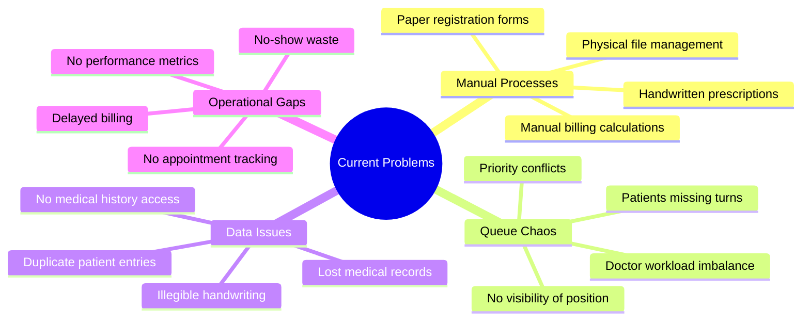

### 3.2 Specific Problems Addressed

| Problem                      | Impact                              | MedFlow Solution                          |
| ---------------------------- | ----------------------------------- | ----------------------------------------- |
| **Paper-based registration** | Slow check-in, data entry errors    | Digital registration with validation      |
| **Unmanaged queues**         | Patient frustration, missed turns   | Real-time queue with token system         |
| **No appointment system**    | Walk-in chaos, doctor overload      | Integrated appointment with grace periods |
| **Lost medical records**     | Repeat tests, treatment delays      | Centralized EHR with visit history        |
| **Manual billing**           | Calculation errors, revenue leakage | Automated billing with service tracking   |
| **No emergency priority**    | Critical patients wait              | Emergency triage with priority override   |
| **Illegible prescriptions**  | Medication errors                   | Digital prescription with drug database   |
| **Consultant coordination**  | Referral delays                     | Seamless OPD-to-Consultant workflow       |

---

## 4. Target Users

### 4.1 Primary Stakeholders

| Role                    | Count (Typical) | Primary Needs                                             |
| ----------------------- | --------------- | --------------------------------------------------------- |
| **Hospital Management** | 2-5             | Operational visibility, reports, efficiency metrics       |
| **Reception Staff**     | 3-8             | Fast registration, queue management, appointment handling |
| **Nurses**              | 5-15            | Vitals entry, pre-screening, patient preparation          |
| **OPD Doctors**         | 5-20            | Patient queue, consultation tools, prescription writing   |
| **Consultants**         | 3-10            | Case review, referral management, surgical planning       |
| **Billing Staff**       | 2-5             | Accurate billing, payment processing, receipt generation  |
| **Patients**            | 100-500/day     | Minimal wait, clear process, quality care                 |

### 4.2 Secondary Stakeholders

- **Lab Technicians** - Receive lab orders, update results
- **Pharmacists** - Access prescriptions, dispense medications
- **IT Administrators** - System configuration, user management

---

## 5. Expected Outcomes

### 5.1 Quantitative Targets

| Metric                           | Current State             | Target State              | Improvement      |
| -------------------------------- | ------------------------- | ------------------------- | ---------------- |
| **Patient Registration Time**    | 5-10 minutes              | 1-2 minutes               | 75% faster       |
| **Average Wait Time**            | 45-90 minutes             | 20-30 minutes             | 60% reduction    |
| **Record Retrieval Time**        | 5-15 minutes              | Instant                   | 100% improvement |
| **Appointment No-show Handling** | Manual tracking           | Automated                 | Full automation  |
| **Billing Accuracy**             | 85-90%                    | 99%+                      | Near-perfect     |
| **Doctor Consultation Rate**     | 15-20 patients/doctor/day | 25-35 patients/doctor/day | 40% increase     |

### 5.2 Qualitative Outcomes

#### For Patients

- ✅ Clear visibility of queue position
- ✅ Reduced physical waiting
- ✅ Better communication on delays
- ✅ Digital prescriptions (legible)
- ✅ Faster appointment booking

#### For Medical Staff

- ✅ Complete patient history at fingertips
- ✅ Streamlined consultation workflow
- ✅ Reduced administrative burden
- ✅ Better case handoff to consultants
- ✅ Legal-compliant documentation

#### For Hospital Administration

- ✅ Real-time operational dashboard
- ✅ Patient flow analytics
- ✅ Revenue tracking
- ✅ Staff performance visibility
- ✅ Reduced operational costs

---

## 6. Success Criteria

### 6.1 Phase 1 Success Metrics (MVP)

| Criteria               | Measurement              | Target                      |
| ---------------------- | ------------------------ | --------------------------- |
| **System Uptime**      | Monthly availability     | ≥ 99.5%                     |
| **User Adoption**      | Active daily users       | 100% of staff               |
| **Patient Throughput** | Daily patients processed | Equal or higher than manual |
| **Error Rate**         | System/data errors       | < 0.1%                      |
| **User Satisfaction**  | Staff feedback score     | ≥ 4/5                       |

### 6.2 Go-Live Checklist

- [ ] All core workflows functional (Walk-in, Appointment, Emergency)
- [ ] All roles can perform their functions
- [ ] Billing generates accurate invoices
- [ ] Data is properly locked after visit completion
- [ ] System handles 50+ concurrent users
- [ ] Backup and recovery tested

---

## 7. Project Scope

### 7.1 In Scope (Phase 1)

| Module                 | Features                                     |
| ---------------------- | -------------------------------------------- |
| **Patient Management** | Registration, search, history                |
| **Appointment System** | Booking, check-in, no-show handling          |
| **Visit & Queue**      | Walk-in, appointment, emergency flows        |
| **OPD Consultation**   | Vitals, examination, diagnosis, prescription |
| **Consultant Review**  | Referral, review, decision                   |
| **Billing**            | Invoice generation, payment recording        |
| **User Management**    | Role-based access, authentication            |

### 7.2 Out of Scope (Future Phases)

| Feature                      | Phase   |
| ---------------------------- | ------- |
| Detailed Analytics & Reports | Phase 2 |
| Inventory Management         | Phase 2 |
| Lab Module (Full)            | Phase 2 |
| Pharmacy Integration         | Phase 2 |
| IPD (Inpatient) Management   | Phase 3 |
| Mobile Application           | Phase 3 |
| Insurance/TPA Integration    | Phase 3 |

---

## 8. Key Design Principles

> These principles are **FROZEN** and guide all development decisions.

### 8.1 Core Principle

```
A Visit represents one clinical journey.
An Appointment is only a booking — not a visit.
```

### 8.2 Guiding Principles

| Principle               | Description                                              |
| ----------------------- | -------------------------------------------------------- |
| **Real Hospital First** | System behavior matches actual hospital workflows        |
| **Doctor-Centric**      | Doctors work naturally, system adapts                    |
| **Data Integrity**      | Completed records are immutable (locked)                 |
| **Role Clarity**        | Each role has distinct responsibilities                  |
| **Fail-Safe**           | No automatic visit completion, explicit actions required |
| **Audit Ready**         | All actions are logged for legal compliance              |

---

## 9. Risk Factors

| Risk                                    | Probability | Impact | Mitigation                        |
| --------------------------------------- | ----------- | ------ | --------------------------------- |
| **User resistance to change**           | High        | High   | Training, gradual rollout         |
| **Data migration issues**               | Medium      | High   | Thorough testing, manual fallback |
| **System performance under load**       | Medium      | High   | Load testing, optimization        |
| **Requirement changes mid-development** | High        | Medium | Change control process            |
| **Integration failures**                | Medium      | Medium | API-first design, mock services   |

---

---

# PART 2: CLINICAL WORKFLOW

## 1. Workflow Overview

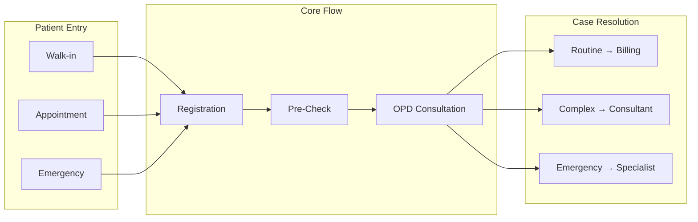

---

## 2. Walk-in Patient Flow

### 2.1 Flow Diagram

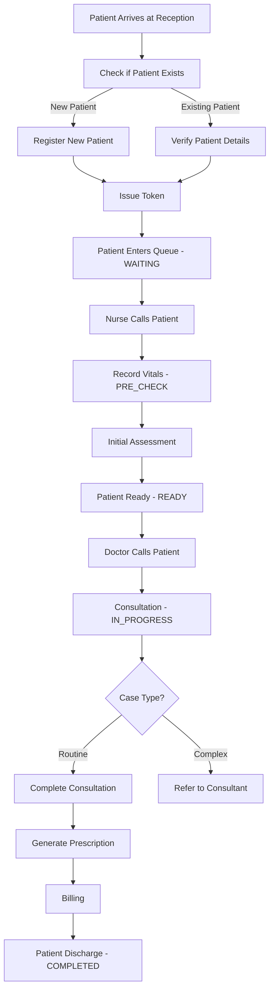

### 2.2 Step-by-Step Process

| Step | Actor     | System Action                                         | State Change                 |
| ---- | --------- | ----------------------------------------------------- | ---------------------------- |
| 1    | Patient   | Arrives at reception counter                          | -                            |
| 2    | Reception | Searches for patient in system                        | -                            |
| 3a   | Reception | If new: Collects demographics, creates patient record | Patient Created              |
| 3b   | Reception | If existing: Verifies and updates details if needed   | -                            |
| 4    | Reception | Creates Visit, issues token number                    | Visit: WAITING               |
| 5    | System    | Patient appears in nurse queue                        | -                            |
| 6    | Nurse     | Calls patient by token/name                           | -                            |
| 7    | Nurse     | Records vitals (BP, Temp, Weight, etc.)               | Visit: PRE_CHECK             |
| 8    | Nurse     | Records chief complaint, initial assessment           | -                            |
| 9    | Nurse     | Marks patient ready for doctor                        | Visit: READY                 |
| 10   | Doctor    | Sees patient in queue, calls                          | Visit: IN_PROGRESS           |
| 11   | Doctor    | Conducts history, examination, diagnosis              | -                            |
| 12   | Doctor    | Writes prescription, orders labs if needed            | -                            |
| 13   | Doctor    | Completes or refers to consultant                     | Visit: COMPLETED or Referral |
| 14   | Billing   | Generates invoice, collects payment                   | -                            |
| 15   | Patient   | Exits hospital                                        | -                            |

### 2.3 Time Expectations

| Phase              | Expected Duration | Maximum Duration |
| ------------------ | ----------------- | ---------------- |
| Registration       | 2 minutes         | 5 minutes        |
| Waiting for Nurse  | 5-10 minutes      | 20 minutes       |
| Pre-Check (Vitals) | 3-5 minutes       | 10 minutes       |
| Waiting for Doctor | 10-20 minutes     | 45 minutes       |
| Consultation       | 5-15 minutes      | 30 minutes       |
| Billing            | 3-5 minutes       | 10 minutes       |

---

## 3. Appointment Patient Flow

### 3.1 Flow Diagram

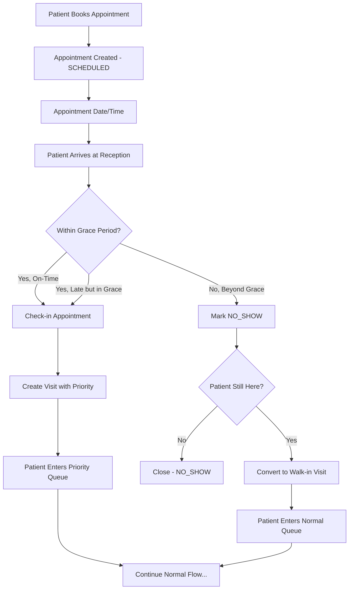

### 3.2 Appointment States

| State          | Description                       | Triggers              |
| -------------- | --------------------------------- | --------------------- |
| **SCHEDULED**  | Appointment booked, awaiting date | Booking complete      |
| **CONFIRMED**  | Patient confirmed (optional)      | SMS/Call confirmation |
| **CHECKED_IN** | Patient arrived and checked in    | Reception check-in    |
| **NO_SHOW**    | Patient did not arrive            | Grace period expired  |
| **CANCELLED**  | Appointment cancelled             | User action           |
| **COMPLETED**  | Visit completed                   | Visit finalization    |

### 3.3 Grace Period Logic

```
Appointment Time: 10:00 AM
Grace Period: 15 minutes (configurable)

Timeline:
├─ 09:30 - 10:00: Early arrival → Check-in as APPOINTMENT ✓
├─ 10:00 - 10:15: On-time/Grace → Check-in as APPOINTMENT ✓
├─ 10:15+: Late beyond grace → Mark NO_SHOW, offer WALK-IN
└─ End of day: Never arrived → Auto NO_SHOW
```

### 3.4 Appointment Priority Queue

| Visit Type            | Queue Priority | Notes                       |
| --------------------- | -------------- | --------------------------- |
| EMERGENCY             | 1 (Highest)    | Immediate attention         |
| APPOINTMENT (On-time) | 2              | Gets priority within slot   |
| APPOINTMENT (Grace)   | 3              | Slightly lower than on-time |
| WALK_IN               | 4              | Normal queue order          |
| APPOINTMENT → WALK_IN | 4              | Converted, loses priority   |

---

## 4. Emergency Patient Flow

### 4.1 Flow Diagram

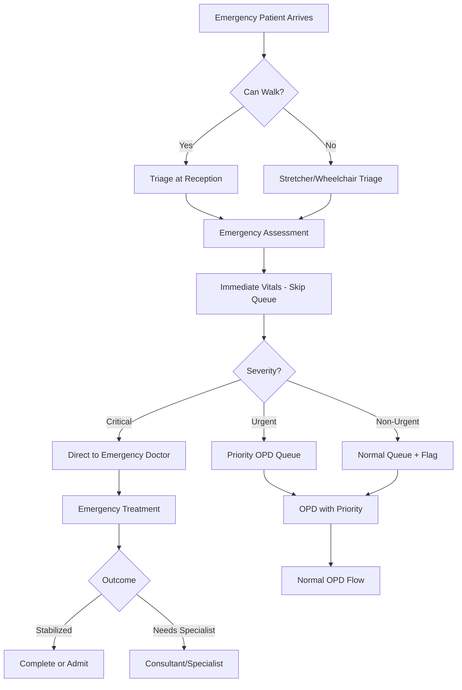

### 4.2 Emergency Triage Categories

| Level | Category    | Response Time | Examples                                      |
| ----- | ----------- | ------------- | --------------------------------------------- |
| **1** | Critical    | Immediate     | Cardiac arrest, major trauma, severe bleeding |
| **2** | Urgent      | < 15 minutes  | Chest pain, breathing difficulty, fractures   |
| **3** | Less Urgent | < 30 minutes  | High fever, severe pain, minor trauma         |
| **4** | Non-Urgent  | < 60 minutes  | Minor injuries, chronic complaints            |

### 4.3 Emergency Visit Characteristics

- **Token Generation:** Immediate, with EMERGENCY prefix (E001, E002...)
- **Queue Position:** Always top (within emergency queue)
- **Vitals:** Taken immediately at triage
- **Doctor Assignment:** Based on availability and specialization
- **Documentation:** Must include triage assessment
- **Billing:** Deferred until stabilized (or post-treatment)

---

## 5. OPD Doctor Consultation Workflow

### 5.1 Consultation Flow

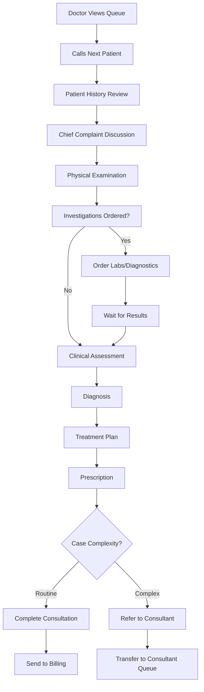

### 5.2 Consultation Components

| Component      | Required | Data Captured                                             |
| -------------- | -------- | --------------------------------------------------------- |
| History Taking | ✅       | Chief complaint, history of present illness, past history |
| Vitals Review  | ✅       | Verify nurse-recorded vitals                              |
| Examination    | ✅       | System-wise examination findings                          |
| Diagnosis      | ✅       | Primary diagnosis, differential diagnoses                 |
| Prescription   | Optional | Medications, dosage, duration, instructions               |
| Lab Orders     | Optional | Tests to be performed                                     |
| Follow-up      | Optional | Next appointment recommendation                           |
| Referral       | Optional | Consultant/specialist referral                            |

### 5.3 Prescription Structure

```
┌─────────────────────────────────────────────────────┐
│  PRESCRIPTION                                        │
├─────────────────────────────────────────────────────┤
│  Patient: [Name], [Age]/[Gender], [MRN]             │
│  Date: [Consultation Date]                          │
│  Doctor: [Doctor Name], [Qualification]             │
├─────────────────────────────────────────────────────┤
│  Diagnosis: [Primary Diagnosis]                     │
├─────────────────────────────────────────────────────┤
│  Rx:                                                │
│  1. [Medicine Name] [Dose] [Frequency] [Duration]   │
│     Instructions: [Before/After food, etc.]        │
│  2. [Medicine Name] [Dose] [Frequency] [Duration]   │
├─────────────────────────────────────────────────────┤
│  Advice:                                            │
│  - [Dietary/Lifestyle instructions]                 │
│  - [Warning signs to watch]                         │
├─────────────────────────────────────────────────────┤
│  Follow-up: [Date/Duration]                         │
│  Labs Ordered: [If any]                             │
└─────────────────────────────────────────────────────┘
```

---

## 6. Consultant Review Workflow

### 6.1 Consultant Flow

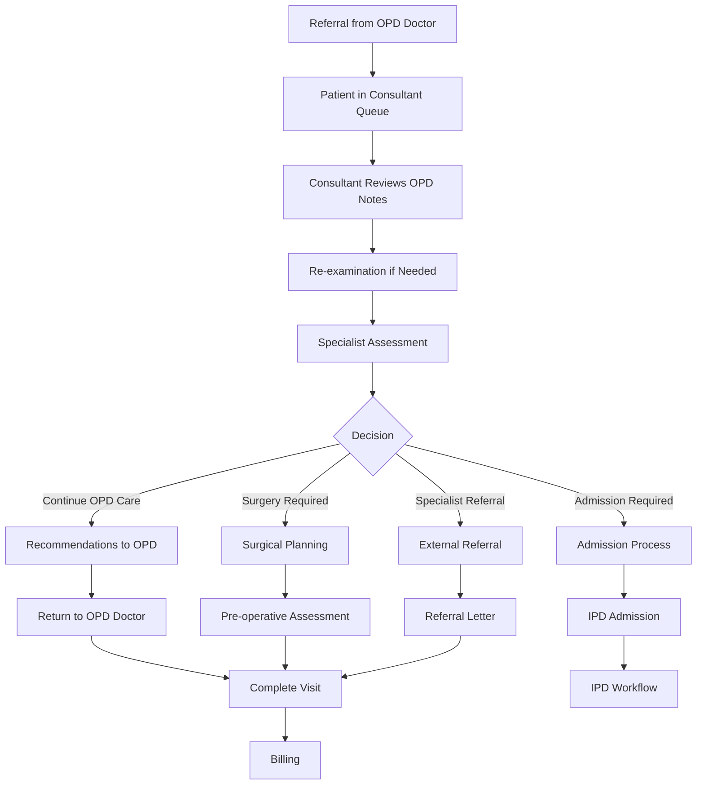

### 6.2 Referral Handoff

| Field                | Source         | Required     |
| -------------------- | -------------- | ------------ |
| Patient Demographics | Auto-populated | ✅           |
| OPD Diagnosis        | OPD Doctor     | ✅           |
| Reason for Referral  | OPD Doctor     | ✅           |
| Examination Findings | OPD Doctor     | ✅           |
| Lab Results          | System         | If available |
| Urgency Level        | OPD Doctor     | ✅           |
| Specific Question    | OPD Doctor     | Recommended  |

### 6.3 Consultant Decision Types

| Decision                      | System Action            | Next Step                 |
| ----------------------------- | ------------------------ | ------------------------- |
| **Medical Management**        | Update treatment plan    | Return to OPD or complete |
| **Surgery Required**          | Create surgery order     | Pre-op workflow           |
| **Admission Required**        | Create admission request | IPD workflow              |
| **External Referral**         | Generate referral letter | Complete visit            |
| **Follow-up with Consultant** | Schedule appointment     | Complete current visit    |

---

## 7. Billing Flow

### 7.1 Billing Trigger Points

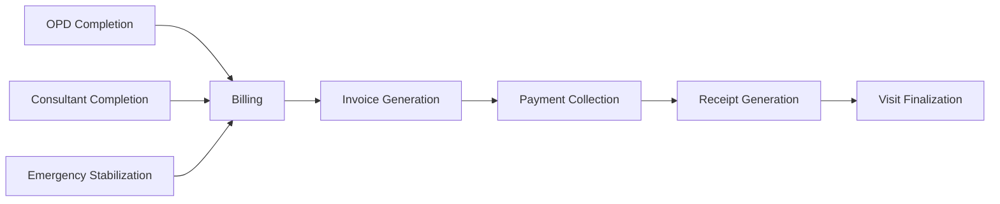

### 7.2 Billable Services

| Service Category | Examples                    | Rate Type           |
| ---------------- | --------------------------- | ------------------- |
| **Registration** | New patient fee             | Fixed               |
| **Consultation** | OPD fee, Consultant fee     | Fixed per type      |
| **Procedures**   | Minor procedures, dressings | Fixed per procedure |
| **Lab Tests**    | Blood tests, imaging        | Fixed per test      |
| **Medications**  | If dispensed in-house       | Variable            |
| **Emergency**    | Emergency handling fee      | Fixed               |

### 7.3 Payment Modes

| Mode          | Process                | Receipt                     |
| ------------- | ---------------------- | --------------------------- |
| Cash          | Direct collection      | Immediate                   |
| Card          | POS terminal           | Immediate                   |
| UPI           | QR code scan           | Immediate                   |
| Insurance/TPA | Pre-auth required      | Deferred                    |
| Credit        | Patient account update | Immediate (partial/pending) |

---

## 8. State Transitions Summary

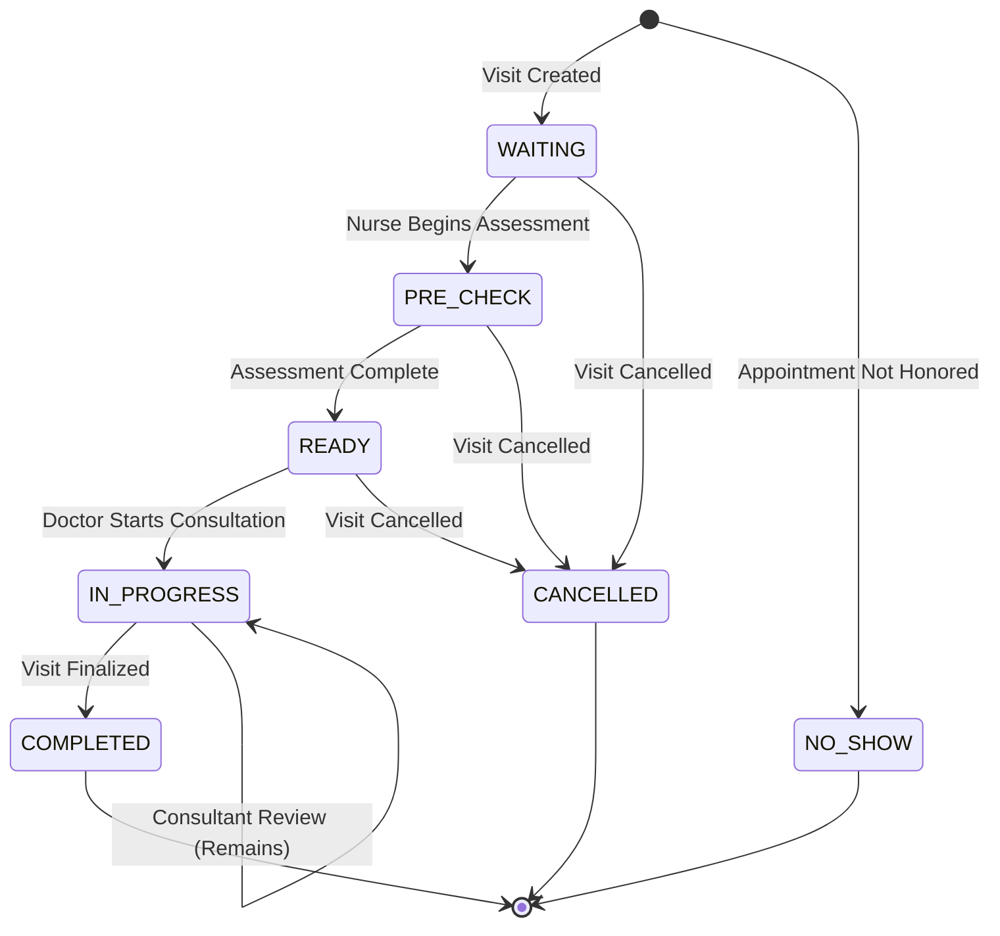

---

## 9. Exception Handling

### 9.1 Common Exceptions

| Exception              | Scenario                          | System Response                     |
| ---------------------- | --------------------------------- | ----------------------------------- |
| **Patient Leaves**     | Patient leaves without completing | Mark CANCELLED, log reason          |
| **Wrong Token**        | Patient assigned wrong queue      | Re-assign, update queue             |
| **Doctor Unavailable** | Doctor leaves mid-day             | Reassign patients to another doctor |
| **System Downtime**    | Technical failure                 | Manual fallback, sync later         |
| **Emergency in OPD**   | Patient deteriorates in queue     | Emergency protocol, priority        |
| **Lab Delay**          | Results delayed                   | Doctor notified, patient waits      |

### 9.2 Fallback Procedures

1. **Manual Token Issuance** - Pre-printed tokens available
2. **Paper Forms** - Registration forms for offline entry
3. **Emergency Protocol** - Staff trained for critical situations
4. **Data Sync** - Offline entries synced when system recovers

---

---

# PART 3: ROLE & RESPONSIBILITY MATRIX

## 1. Role Overview

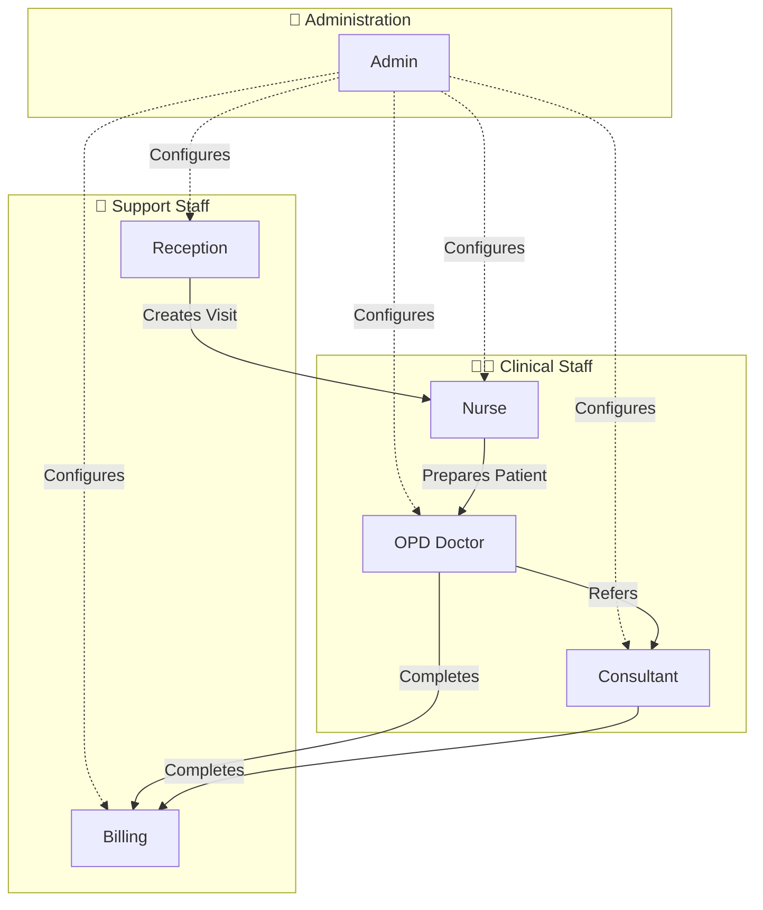

---

## 2. Role Definitions

### 2.1 Reception Staff

| Attribute            | Details                        |
| -------------------- | ------------------------------ |
| **Primary Function** | Patient entry point management |
| **Reports To**       | Hospital Administration        |
| **Working Hours**    | Hospital operating hours       |
| **System Access**    | Reception Dashboard            |

**Key Responsibilities:**

- New patient registration
- Existing patient verification
- Token issuance
- Appointment check-in
- Queue visibility (read-only)
- Basic patient data updates

---

### 2.2 Nurse

| Attribute            | Details                              |
| -------------------- | ------------------------------------ |
| **Primary Function** | Pre-consultation patient preparation |
| **Reports To**       | Nursing Supervisor                   |
| **Working Hours**    | Shift-based                          |
| **System Access**    | Nurse Dashboard                      |

**Key Responsibilities:**

- Patient vitals recording
- Initial assessment/triage
- Chief complaint documentation
- Patient queue management
- Emergency triage classification
- Doctor queue preparation

---

### 2.3 OPD Doctor

| Attribute            | Details                    |
| -------------------- | -------------------------- |
| **Primary Function** | Primary care and treatment |
| **Reports To**       | Head of Department         |
| **Working Hours**    | OPD schedule               |
| **System Access**    | Doctor Dashboard           |

**Key Responsibilities:**

- Patient consultation
- History taking and examination
- Diagnosis and treatment
- Prescription writing
- Lab ordering
- Routine case completion
- Complex case referral
- Follow-up advice

---

### 2.4 Consultant / Specialist

| Attribute            | Details                         |
| -------------------- | ------------------------------- |
| **Primary Function** | Expert review and advanced care |
| **Reports To**       | Clinical Director               |
| **Working Hours**    | Scheduled/On-call               |
| **System Access**    | Consultant Dashboard            |

**Key Responsibilities:**

- Review referred cases
- Specialist examination
- Confirm/modify diagnosis
- Surgery recommendations
- Admission decisions
- External referrals
- Treatment plan modifications

---

### 2.5 Billing Staff

| Attribute            | Details                  |
| -------------------- | ------------------------ |
| **Primary Function** | Financial transactions   |
| **Reports To**       | Finance Manager          |
| **Working Hours**    | Hospital operating hours |
| **System Access**    | Billing Dashboard        |

**Key Responsibilities:**

- Invoice generation
- Payment collection
- Receipt issuance
- Pending payment tracking
- Refund processing (with approval)
- Day-end reconciliation

---

### 2.6 Administrator

| Attribute            | Details              |
| -------------------- | -------------------- |
| **Primary Function** | System configuration |
| **Reports To**       | IT Manager           |
| **Working Hours**    | As required          |
| **System Access**    | Admin Panel          |

**Key Responsibilities:**

- User management
- Role assignment
- System configuration
- Master data management
- Audit log review
- Report generation

---

## 3. Responsibility Matrix (RACI)

> **Legend:** R = Responsible, A = Accountable, C = Consulted, I = Informed

### 3.1 Patient Registration Activities

| Activity                    | Reception | Nurse | Doctor | Consultant | Billing | Admin   |
| --------------------------- | --------- | ----- | ------ | ---------- | ------- | ------- |
| Create new patient          | **R/A**   | -     | -      | -          | -       | I       |
| Update patient demographics | **R/A**   | C     | -      | -          | -       | I       |
| Verify patient identity     | **R/A**   | C     | -      | -          | C       | -       |
| Merge duplicate records     | C         | -     | -      | -          | -       | **R/A** |

---

### 3.2 Queue Management Activities

| Activity                | Reception | Nurse   | Doctor  | Consultant | Billing | Admin |
| ----------------------- | --------- | ------- | ------- | ---------- | ------- | ----- |
| Issue visit token       | **R/A**   | -       | -       | -          | -       | -     |
| View queue              | R         | R       | R       | R          | R       | I     |
| Call patient            | -         | **R/A** | **R/A** | **R/A**    | -       | -     |
| Re-order queue          | C         | **R/A** | A       | A          | -       | I     |
| Cancel visit            | **R/A**   | C       | A       | A          | I       | I     |
| Mark emergency priority | C         | **R/A** | A       | A          | -       | I     |

---

### 3.3 Clinical Activities

| Activity             | Reception | Nurse   | Doctor  | Consultant | Billing | Admin |
| -------------------- | --------- | ------- | ------- | ---------- | ------- | ----- |
| Record vitals        | -         | **R/A** | C       | -          | -       | -     |
| Initial assessment   | -         | **R/A** | C       | -          | -       | -     |
| Patient history      | -         | C       | **R/A** | C          | -       | -     |
| Physical examination | -         | -       | **R/A** | **R/A**    | -       | -     |
| Diagnosis            | -         | -       | **R/A** | **R/A**    | -       | -     |
| Prescription         | -         | -       | **R/A** | **R/A**    | -       | -     |
| Order investigations | -         | -       | **R/A** | **R/A**    | I       | -     |
| Refer to consultant  | -         | -       | **R/A** | -          | -       | -     |
| Surgery decision     | -         | -       | C       | **R/A**    | I       | -     |
| Admission decision   | -         | -       | C       | **R/A**    | I       | I     |
| Complete visit       | -         | -       | **R/A** | **R/A**    | I       | -     |

---

### 3.4 Billing Activities

| Activity             | Reception | Nurse | Doctor | Consultant | Billing | Admin   |
| -------------------- | --------- | ----- | ------ | ---------- | ------- | ------- |
| Generate invoice     | -         | -     | I      | I          | **R/A** | -       |
| Collect payment      | -         | -     | -      | -          | **R/A** | I       |
| Issue receipt        | -         | -     | -      | -          | **R/A** | -       |
| Process refund       | -         | -     | -      | -          | R       | **A**   |
| Credit management    | -         | -     | -      | -          | R       | **A**   |
| View billing reports | -         | -     | -      | -          | R       | **R/A** |

---

## 4. Handoff Points

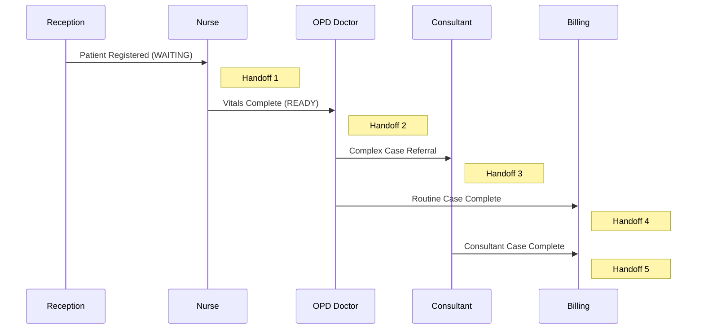

### 4.1 Handoff Requirements

| Handoff | From       | To         | Required Data                               | System Action                |
| ------- | ---------- | ---------- | ------------------------------------------- | ---------------------------- |
| 1       | Reception  | Nurse      | Patient info, Token, Visit type             | Queue notification           |
| 2       | Nurse      | Doctor     | Vitals, Chief complaint, Initial assessment | Queue update, Status change  |
| 3       | Doctor     | Consultant | Diagnosis, Exam findings, Referral reason   | Transfer queue, Notification |
| 4       | Doctor     | Billing    | Visit completion, Services rendered         | Bill generation              |
| 5       | Consultant | Billing    | Decision, Additional services               | Bill update                  |

---

## 5. Role-Based Dashboard Access

| Dashboard/Screen | Reception | Nurse | Doctor | Consultant | Billing | Admin |
| ---------------- | --------- | ----- | ------ | ---------- | ------- | ----- |
| Patient Search   | ✅        | ✅    | ✅     | ✅         | ✅      | ✅    |
| Registration     | ✅        | ❌    | ❌     | ❌         | ❌      | ✅    |
| Queue Management | View      | Edit  | Edit   | Edit       | View    | ✅    |
| Vitals Entry     | ❌        | ✅    | View   | View       | ❌      | View  |
| Consultation     | ❌        | ❌    | ✅     | ✅         | ❌      | View  |
| Prescription     | ❌        | ❌    | ✅     | ✅         | View    | View  |
| Billing          | ❌        | ❌    | ❌     | ❌         | ✅      | ✅    |
| Reports          | ❌        | ❌    | Own    | Own        | Own     | ✅    |
| Settings         | ❌        | ❌    | ❌     | ❌         | ❌      | ✅    |
| Audit Logs       | ❌        | ❌    | ❌     | ❌         | ❌      | ✅    |

---

---

# PART 4: TERMINOLOGY & DEFINITIONS

## 1. Core Concepts

### 1.1 Patient

| Term                            | Definition                                        | Example                    |
| ------------------------------- | ------------------------------------------------- | -------------------------- |
| **Patient**                     | An individual who receives or seeks medical care  | John Doe, MRN: P00001      |
| **MRN (Medical Record Number)** | Unique identifier for a patient across all visits | P00001                     |
| **Demographics**                | Basic patient information                         | Name, Age, Gender, Contact |
| **Medical History**             | Record of past medical conditions and treatments  | Diabetes since 2020        |
| **New Patient**                 | Patient with no prior record in the system        | First-time visitor         |
| **Existing Patient**            | Patient with prior record(s) in the system        | Return visitor             |

---

### 1.2 Visit vs Appointment

> [!CAUTION]
> This distinction is fundamental to the system design. Do NOT confuse these terms.

| Term            | Definition                                            | Key Difference                                     |
| --------------- | ----------------------------------------------------- | -------------------------------------------------- |
| **Visit**       | A single clinical encounter from arrival to discharge | **Exists only when patient is physically present** |
| **Appointment** | A scheduled future booking for a visit                | **Is only a booking, not a visit**                 |

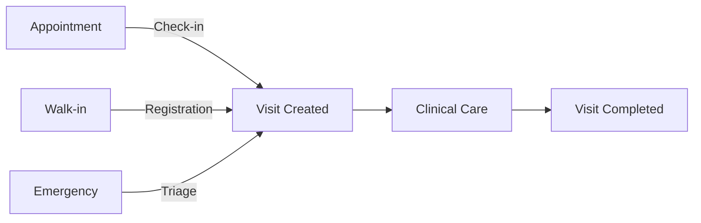

**Key Rules:**

1. An Appointment becomes irrelevant once a Visit is created
2. A Visit can exist without an Appointment (walk-in, emergency)
3. An Appointment without check-in remains as NO_SHOW
4. Patient history is tied to Visits, not Appointments

---

### 1.3 Visit Types

| Type            | Code          | Definition                            | Priority |
| --------------- | ------------- | ------------------------------------- | -------- |
| **Walk-in**     | `WALK_IN`     | Patient arrives without prior booking | Normal   |
| **Appointment** | `APPOINTMENT` | Patient arrives for pre-booked slot   | High     |
| **Emergency**   | `EMERGENCY`   | Patient requires immediate care       | Highest  |
| **Follow-up**   | `FOLLOW_UP`   | Return visit for ongoing treatment    | Normal\* |

\*Follow-up may have priority if doctor-specified

---

### 1.4 Visit States

| State           | Code          | Definition                         | Can Transition To      |
| --------------- | ------------- | ---------------------------------- | ---------------------- |
| **Waiting**     | `WAITING`     | Visit created, patient in queue    | PRE_CHECK, CANCELLED   |
| **Pre-Check**   | `PRE_CHECK`   | Nurse assessing patient            | READY, CANCELLED       |
| **Ready**       | `READY`       | Patient prepared for doctor        | IN_PROGRESS, CANCELLED |
| **In Progress** | `IN_PROGRESS` | Doctor consulting patient          | COMPLETED              |
| **Completed**   | `COMPLETED`   | Visit finalized and locked         | - (Terminal)           |
| **Cancelled**   | `CANCELLED`   | Visit cancelled before completion  | - (Terminal)           |
| **No Show**     | `NO_SHOW`     | Appointment patient did not arrive | - (Terminal)           |

---

### 1.5 Appointment States

| State          | Code         | Definition                        |
| -------------- | ------------ | --------------------------------- |
| **Scheduled**  | `SCHEDULED`  | Appointment booked, awaiting date |
| **Confirmed**  | `CONFIRMED`  | Patient confirmed attendance      |
| **Checked-In** | `CHECKED_IN` | Patient arrived, visit created    |
| **Cancelled**  | `CANCELLED`  | Appointment cancelled             |
| **No Show**    | `NO_SHOW`    | Patient did not arrive            |
| **Completed**  | `COMPLETED`  | Associated visit completed        |

---

## 2. Clinical Terms

### 2.1 Consultation Types

| Term               | Definition                                              | Actor             |
| ------------------ | ------------------------------------------------------- | ----------------- |
| **Consultation**   | Primary clinical encounter with diagnosis and treatment | OPD Doctor        |
| **Review**         | Expert evaluation of a referred case                    | Consultant        |
| **Follow-up**      | Subsequent visit for ongoing care                       | Doctor/Consultant |
| **Second Opinion** | Another doctor's evaluation of same case                | Any Doctor        |
| **Triage**         | Initial assessment to determine priority                | Nurse             |

### 2.2 Case Classification

| Term              | Definition                             | Implication         |
| ----------------- | -------------------------------------- | ------------------- |
| **Routine Case**  | Standard case manageable by OPD Doctor | Complete in OPD     |
| **Complex Case**  | Case requiring specialist input        | Refer to Consultant |
| **Critical Case** | Life-threatening condition             | Emergency protocol  |
| **Chronic Case**  | Long-term ongoing condition            | Regular follow-ups  |

### 2.3 Clinical Documentation

| Term                                 | Definition                              | Owner         |
| ------------------------------------ | --------------------------------------- | ------------- |
| **Chief Complaint**                  | Primary reason for visit                | Patient/Nurse |
| **History of Present Illness (HPI)** | Detailed description of current problem | Doctor        |
| **Past Medical History (PMH)**       | Record of prior conditions              | Doctor        |
| **Review of Systems (ROS)**          | System-wise symptom inquiry             | Doctor        |
| **Physical Examination (PE)**        | Objective findings from exam            | Doctor        |
| **Impression/Diagnosis**             | Doctor's clinical conclusion            | Doctor        |
| **Plan**                             | Treatment approach                      | Doctor        |
| **Prescription (Rx)**                | Medications ordered                     | Doctor        |
| **Advice**                           | Non-medication instructions             | Doctor        |

### 2.4 Vitals

| Term                  | Abbreviation | Unit        | Normal Range (Adult)  |
| --------------------- | ------------ | ----------- | --------------------- |
| **Blood Pressure**    | BP           | mmHg        | 90/60 - 120/80        |
| **Heart Rate/Pulse**  | HR/P         | bpm         | 60-100                |
| **Temperature**       | Temp         | °F/°C       | 97-99°F / 36.1-37.2°C |
| **Respiratory Rate**  | RR           | breaths/min | 12-20                 |
| **Oxygen Saturation** | SpO2         | %           | 95-100                |
| **Weight**            | Wt           | kg          | Variable              |
| **Height**            | Ht           | cm          | Variable              |
| **BMI**               | BMI          | kg/m²       | 18.5-24.9             |

---

## 3. Queue Terms

| Term               | Definition                                       |
| ------------------ | ------------------------------------------------ |
| **Token**          | Unique identifier for a visit in the daily queue |
| **Queue**          | Ordered list of patients waiting                 |
| **Queue Position** | Patient's current place in line                  |
| **Priority Queue** | Queue with higher precedence                     |
| **Call**           | Action of summoning patient from queue           |
| **Skip**           | Temporarily bypass a patient in queue            |
| **Re-queue**       | Place patient back in queue                      |

---

## 4. Billing Terms

| Term             | Definition                           |
| ---------------- | ------------------------------------ |
| **Invoice**      | Bill generated for services rendered |
| **Line Item**    | Individual service on an invoice     |
| **Gross Amount** | Total before discounts               |
| **Discount**     | Reduction in amount                  |
| **Net Amount**   | Amount due after discounts           |
| **Payment**      | Money received against invoice       |
| **Balance**      | Amount remaining to be paid          |
| **Receipt**      | Proof of payment                     |
| **Credit**       | Amount owed to/from patient          |
| **Refund**       | Return of previously paid amount     |

---

## 5. Common Abbreviations

| Abbreviation | Full Form                  |
| ------------ | -------------------------- |
| OPD          | Outpatient Department      |
| IPD          | Inpatient Department       |
| ER/ED        | Emergency Room/Department  |
| EMR          | Electronic Medical Record  |
| EHR          | Electronic Health Record   |
| MRN          | Medical Record Number      |
| DOB          | Date of Birth              |
| HPI          | History of Present Illness |
| PMH          | Past Medical History       |
| Rx           | Prescription               |
| Dx           | Diagnosis                  |
| Tx           | Treatment                  |
| F/U          | Follow-up                  |
| PRN          | As needed (Pro Re Nata)    |
| STAT         | Immediately                |
| TPA          | Third Party Administrator  |

---

## 6. Terms to Avoid (Anti-Patterns)

| ❌ Don't Use | ✅ Use Instead | Reason                             |
| ------------ | -------------- | ---------------------------------- |
| Case         | Visit          | Case is ambiguous                  |
| Record       | Visit/Patient  | Specify entity                     |
| Booking      | Appointment    | Consistency                        |
| Slot         | Time Slot      | Clarity                            |
| Check-up     | Consultation   | Medical accuracy                   |
| OPD Ticket   | Token          | Standard term                      |
| Bill         | Invoice        | System distinction                 |
| Cancel       | Specify action | Cancel visit vs Cancel appointment |

---

# COMPLETE PATIENT JOURNEY DIAGRAM

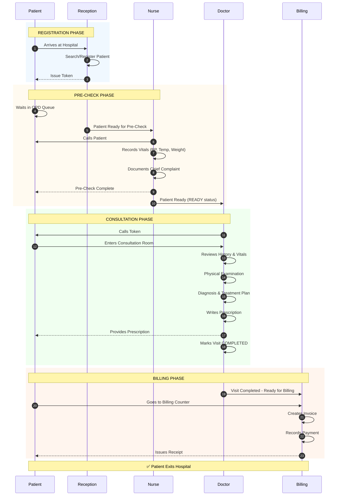

---

# APPROVAL SECTION

| Role               | Name                       | Date             | Signature      |
| ------------------ | -------------------------- | ---------------- | -------------- |
| Clinical Director  | **\*\*\*\***\_**\*\*\*\*** | \***\*\_\_\*\*** | \***\*\_\*\*** |
| Head of OPD        | **\*\*\*\***\_**\*\*\*\*** | \***\*\_\_\*\*** | \***\*\_\*\*** |
| Nursing Supervisor | **\*\*\*\***\_**\*\*\*\*** | \***\*\_\_\*\*** | \***\*\_\*\*** |
| IT Head            | **\*\*\*\***\_**\*\*\*\*** | \***\*\_\_\*\*** | \***\*\_\*\*** |

---

> [!IMPORTANT]
> This document is **FROZEN** for development purposes. Any modifications require formal Change Request approval through the Change Control Process.

---

**Document Control:**

- Version: 1.0
- Created: January 2026
- Classification: Doctor Review Document
