# 📊 Phase 2: IPD Admission - Workflow Diagrams

**Document Version:** 1.0  
**Last Updated:** February 27, 2026  
**Status:** Draft

---

## 1. Document Purpose

This document provides **visual workflow diagrams** for the IPD Admission Module, illustrating process flows, decision points, and system interactions.

---

## 2. Complete Admission Workflow

### 2.1 End-to-End Admission Process

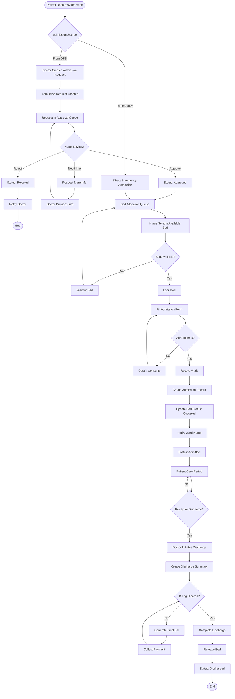

---

## 3. Detailed Workflow Diagrams

### 3.1 Admission Request Creation (From OPD)

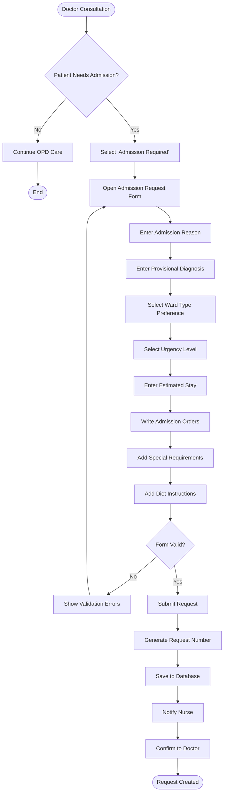

---

### 3.2 Admission Request Approval Process

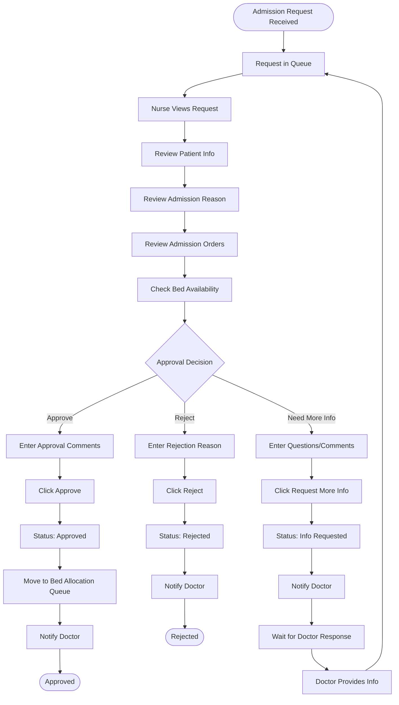

---

### 3.3 Bed Allocation Process

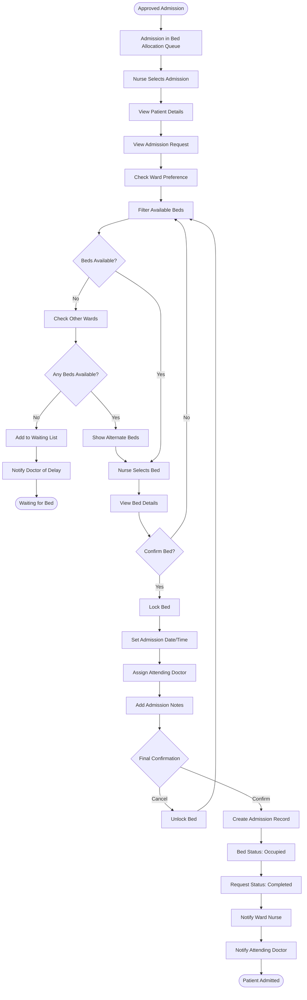

---

### 3.4 Emergency Admission Process

```mermaid
flowchart TD
    Start([Emergency Patient Arrival]) --> Reception[Nurse Receives Patient]
    Reception --> Assess{Life Threatening?}
    
    Assess -->|Yes| ImmediateCare[Immediate Medical Care]
    ImmediateCare --> Stabilize[Stabilize Patient]
    Stabilize --> PostStabilize[After Stabilization]
    PostStabilize --> CreateAdm
    
    Assess -->|No| CreateAdm[Create Emergency Admission]
    
    CreateAdm --> SearchPatient{Existing Patient?}
    
    SearchPatient -->|Yes| SelectPatient[Select Patient]
    SearchPatient -->|No| QuickReg[Quick Registration]
    
    QuickReg --> SelectPatient
    SelectPatient --> EmergencyForm[Fill Emergency Admission Form]
    
    EmergencyForm --> EnterReason[Enter Emergency Reason]
    EnterReason --> EnterDiagnosis[Enter Provisional Diagnosis]
    EnterDiagnosis --> SelectDoctor[Select Admitting Doctor]
    SelectDoctor --> AutoApprove[Auto-Approve Request]
    
    AutoApprove --> FindBed[Find Emergency Bed]
    FindBed --> EmergencyBed{Emergency Bed Available?}
    
    EmergencyBed -->|No| FindAnyBed[Find Any Available Bed]
    FindAnyBed --> AnyBed{Any Bed Available?}
    
    AnyBed -->|No| Escalate[Escalate to Supervisor]
    Escalate --> ManualAlloc[Manual Bed Allocation]
    ManualAlloc --> AllocateBed
    
    AnyBed -->|Yes| AllocateBed[Allocate Bed]
    EmergencyBed -->|Yes| AllocateBed
    
    AllocateBed --> QuickVitals[Record Quick Vitals]
    QuickVitals --> MinimalConsent[Obtain Minimal Consent]
    MinimalConsent --> CreateRecord[Create Admission Record]
    CreateRecord --> UpdateBed[Update Bed Status]
    UpdateBed --> NotifyAll[Notify Ward & Doctor]
    NotifyAll --> Admitted[Status: Admitted]
    Admitted --> FullDocLater[Complete Documentation Later]
    FullDocLater --> End([Emergency Admission Complete])
```

---

### 3.5 Bed Transfer Process

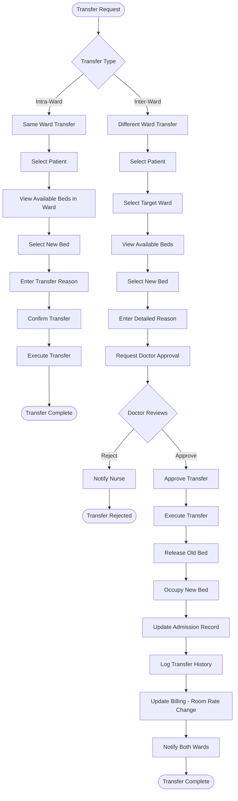

---

### 3.6 Discharge Process

```mermaid
flowchart TD
    Start([Patient Ready for Discharge]) --> DoctorInitiate[Doctor Initiates Discharge]
    
    DoctorInitiate --> DischargeForm[Open Discharge Form]
    DischargeForm --> SelectType[Select Discharge Type]
    
    SelectType --> TypeCheck{Discharge Type}
    
    TypeCheck -->|Regular| RegularFlow[Regular Discharge Flow]
    TypeCheck -->|LAMA| LAMAFlow[LAMA Flow]
    TypeCheck -->|Death| DeathFlow[Death Flow]
    
    RegularFlow --> EnterDiagnosis[Enter Final Diagnosis]
    EnterDiagnosis --> WriteHospitalCourse[Write Hospital Course]
    WriteHospitalCourse --> ListProcedures[List Procedures Performed]
    ListProcedures --> SummarizeInvestigations[Summarize Investigations]
    SummarizeInvestigations --> PrescribeMeds[Prescribe Discharge Medications]
    PrescribeMeds --> DietAdvice[Add Diet Advice]
    DietAdvice --> ActivityRestrictions[Add Activity Restrictions]
    ActivityRestrictions --> WarningSigns[List Warning Signs]
    WarningSigns --> FollowUpInstructions[Add Follow-up Instructions]
    FollowUpInstructions --> SetFollowUpDate[Set Follow-up Date]
    SetFollowUpDate --> ValidateForm
    
    LAMAFlow --> LAMAForm[Generate LAMA Form]
    LAMAForm --> GetSignature[Obtain Patient/Relative Signature]
    GetSignature --> UploadSignature[Upload Signed Form]
    UploadSignature --> MinimalSummary[Minimal Discharge Summary]
    MinimalSummary --> ValidateForm
    
    DeathFlow --> DeathDetails[Enter Death Details]
    DeathDetails --> DeathTime[Record Death Time]
    DeathTime --> DeathCause[Enter Cause of Death]
    DeathCause --> DeathSummary[Write Death Summary]
    DeathSummary --> ValidateForm
    
    ValidateForm{Form Valid?}
    
    ValidateForm -->|No| ShowErrors[Show Validation Errors]
    ShowErrors --> DischargeForm
    
    ValidateForm -->|Yes| SaveSummary[Save Discharge Summary]
    SaveSummary --> GeneratePDF[Generate Summary PDF]
    GeneratePDF --> UpdateStatus[Status: Discharge Pending]
    UpdateStatus --> NotifyBilling[Notify Billing Team]
    
    NotifyBilling --> BillingProcess[Reception Billing Process]
    BillingProcess --> CalculateCharges[Calculate All Charges]
    CalculateCharges --> GenerateFinalBill[Generate Final Bill]
    GenerateFinalBill --> CheckDeposit{Deposit Sufficient?}
    
    CheckDeposit -->|Yes| AdjustDeposit[Adjust Deposit]
    CheckDeposit -->|No| CollectBalance[Collect Balance Payment]
    
    AdjustDeposit --> RefundCheck{Refund Due?}
    RefundCheck -->|Yes| ProcessRefund[Process Refund]
    RefundCheck -->|No| BillingCleared
    
    CollectBalance --> BillingCleared[Mark Billing Cleared]
    ProcessRefund --> BillingCleared
    
    BillingCleared --> CompleteDischarge[Complete Discharge]
    CompleteDischarge --> ReleaseBed[Release Bed]
    ReleaseBed --> UpdateAdmStatus[Status: Discharged]
    UpdateAdmStatus --> RecordDischargeTime[Record Actual Discharge Time]
    RecordDischargeTime --> PrintDocuments[Print Discharge Documents]
    PrintDocuments --> HandoverDocs[Handover Documents to Patient]
    HandoverDocs --> End([Discharge Complete])
```

---

### 3.7 Billing Integration Flow

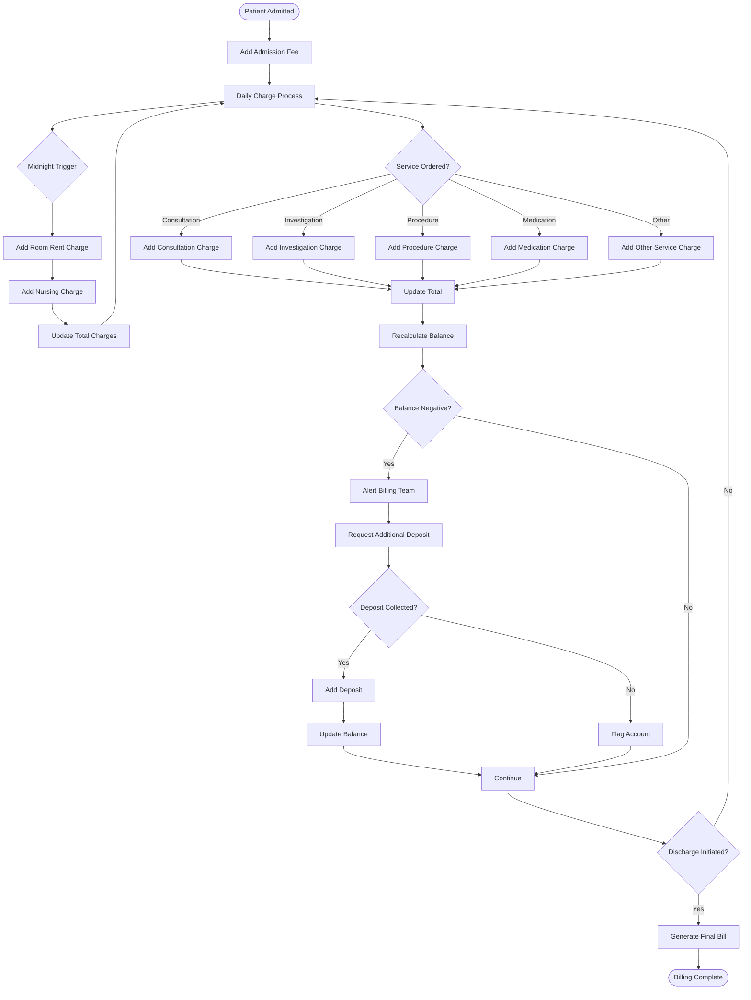

---

### 3.8 Ward Dashboard Update Flow

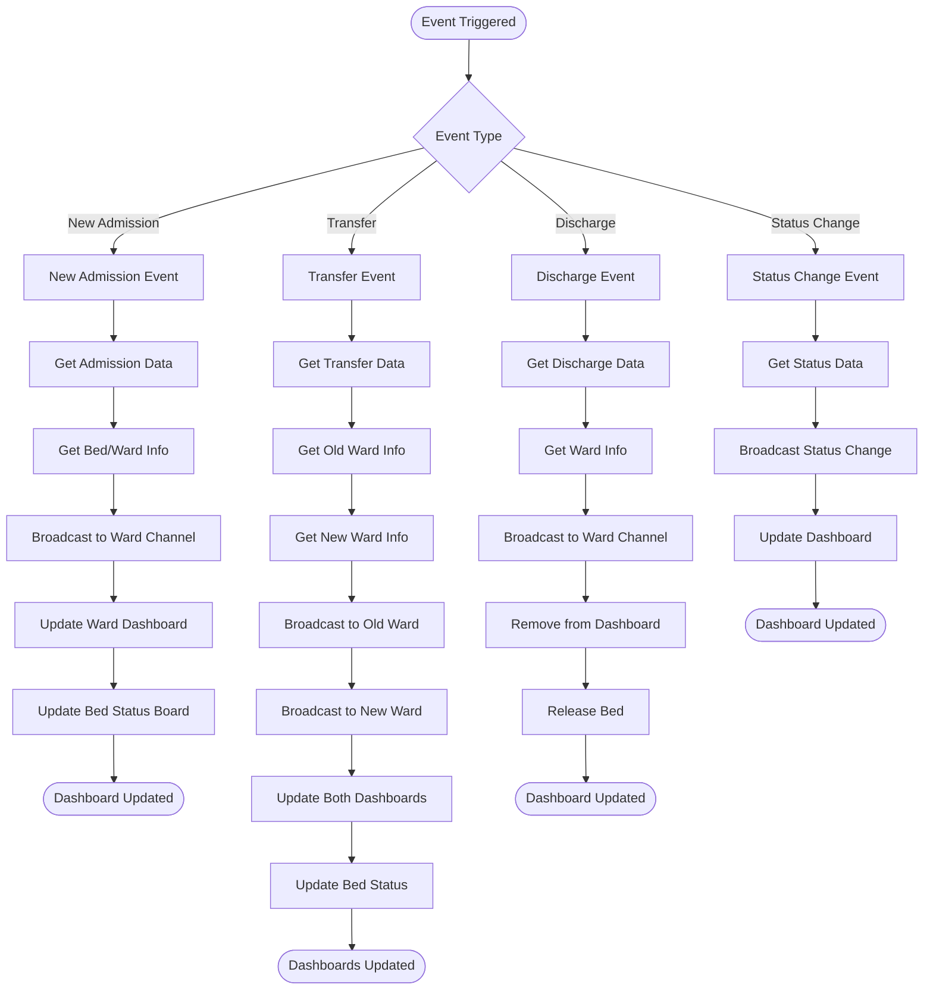

---

## 4. Decision Trees

### 4.1 Bed Selection Decision Tree

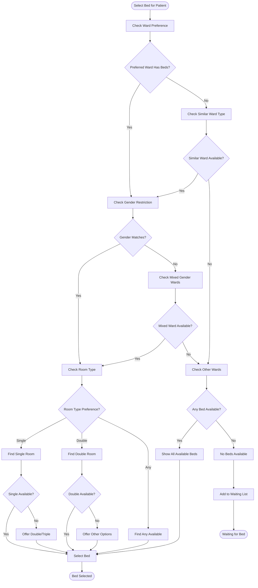

---

### 4.2 Discharge Type Decision Tree

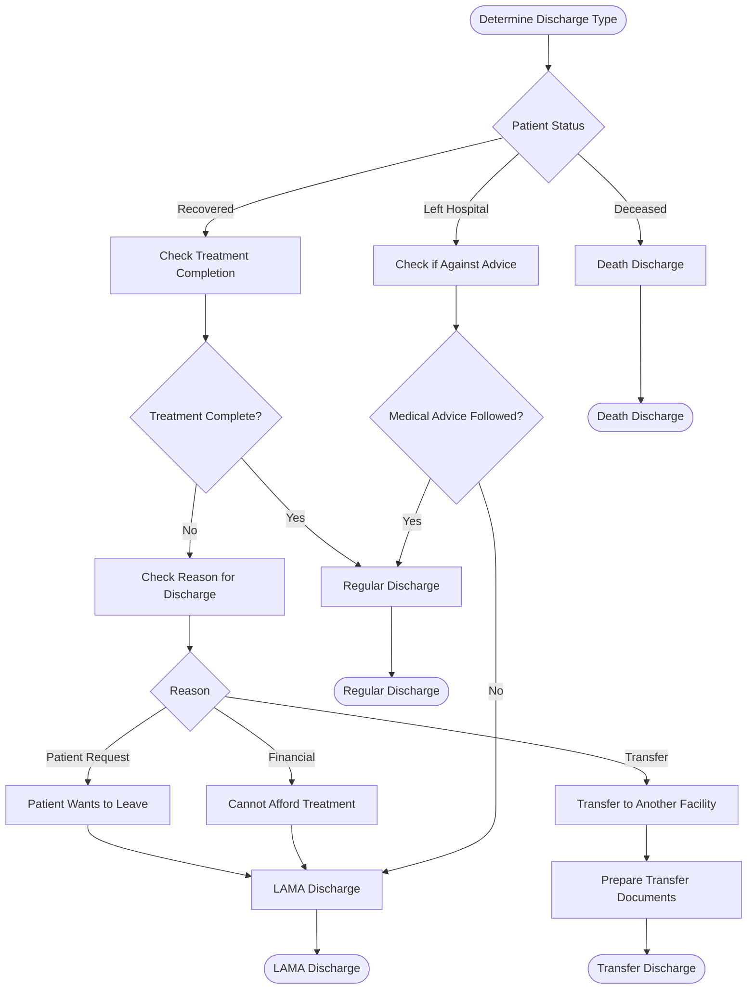

---

## 5. State Diagrams

### 5.1 Admission Request States

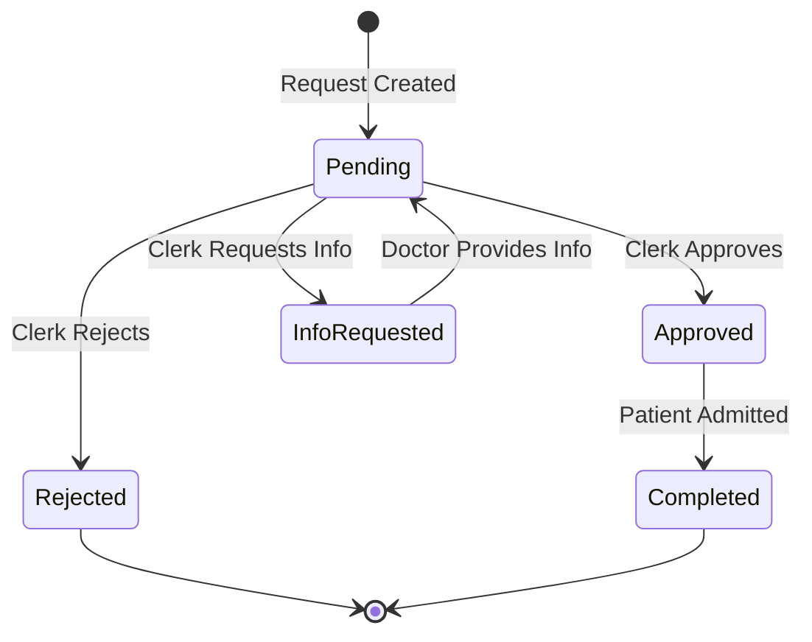

---

### 5.2 Admission States

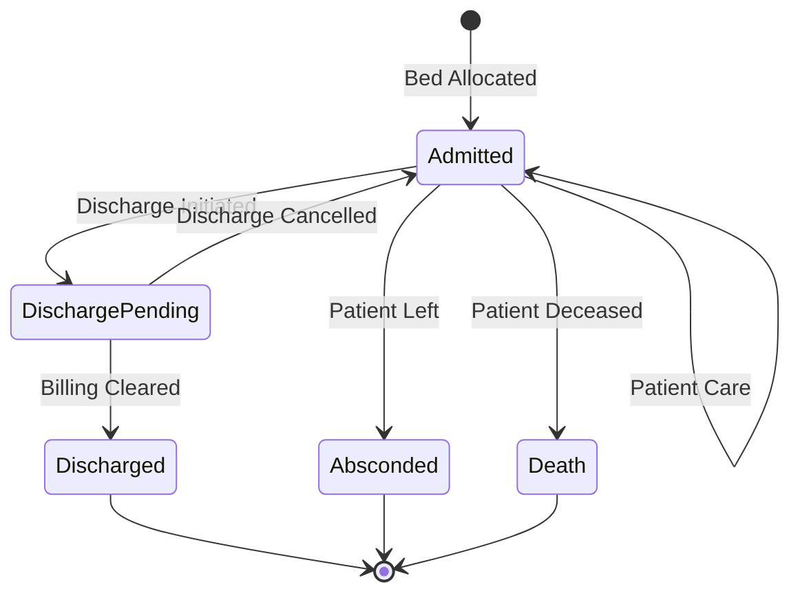

---

### 5.3 Bed States

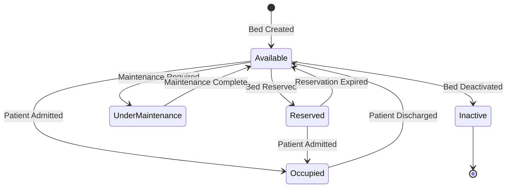

---

## 6. Sequence Diagrams

### 6.1 Bed Allocation Sequence

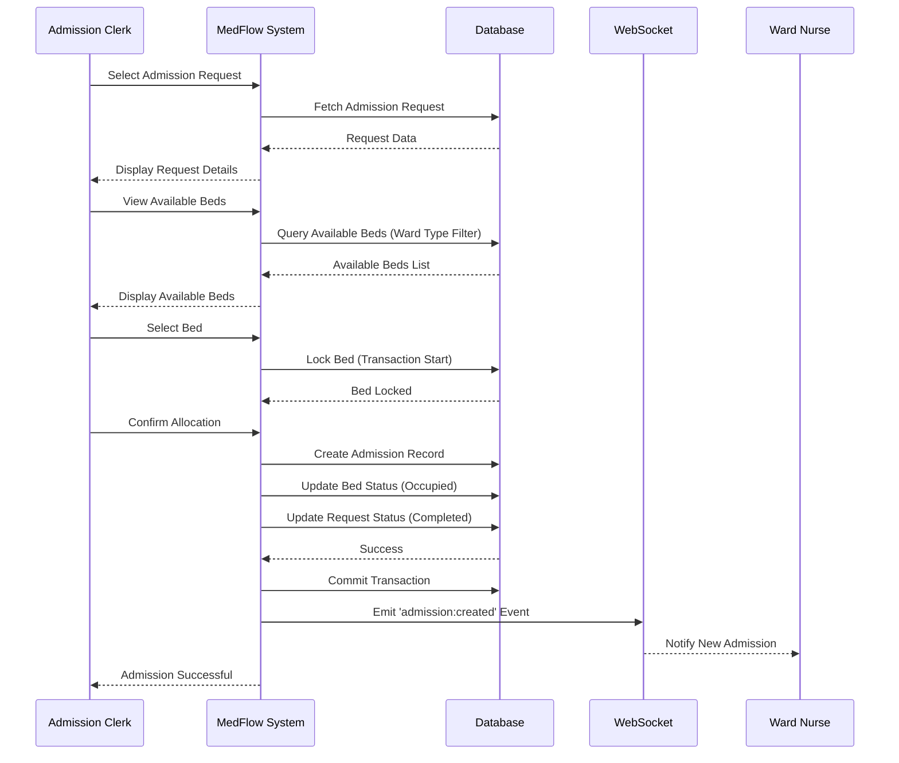

---

## 7. Activity Diagrams

### 7.1 Daily Room Rent Calculation

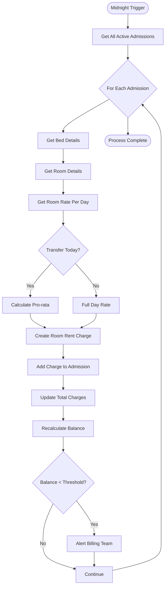

---

## 8. Use Case Diagram

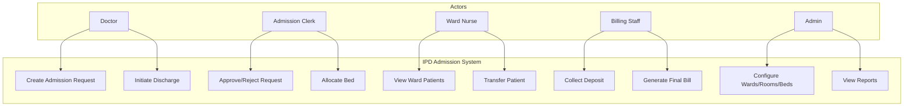

---

> **Note:** These diagrams are created using Mermaid syntax and will render in Markdown viewers that support Mermaid (GitHub, GitLab, VS Code with extensions, etc.).
