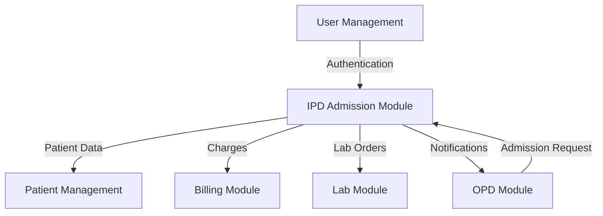
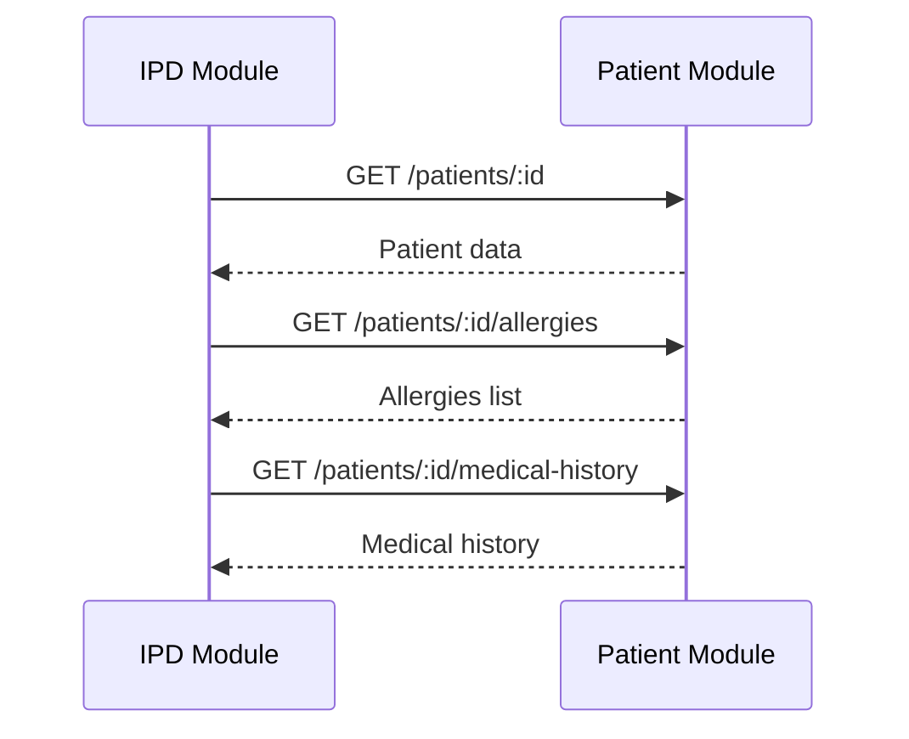
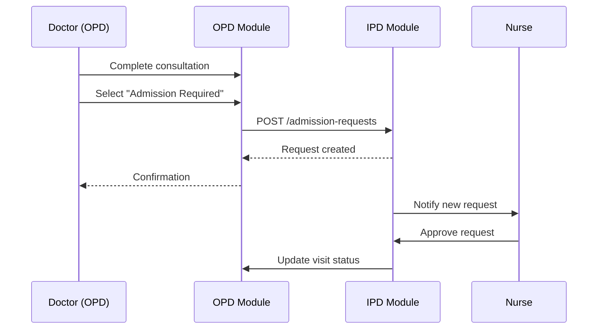
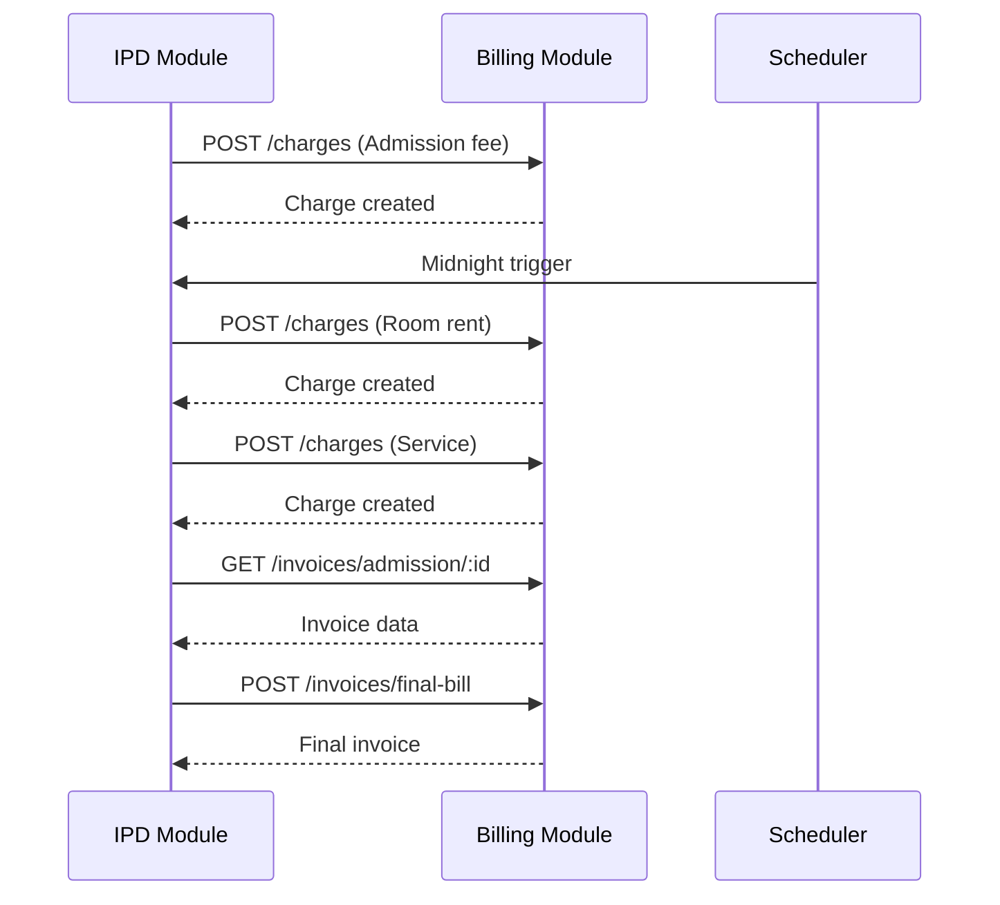
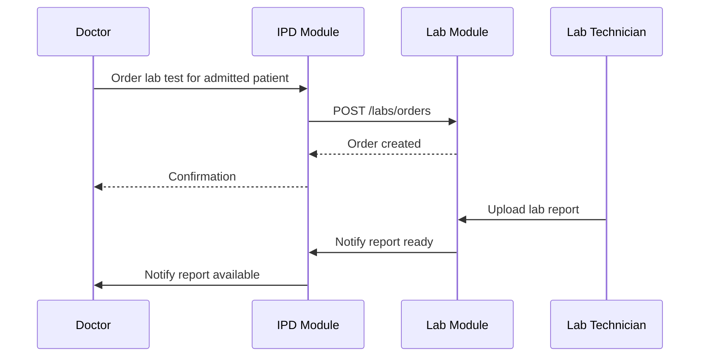

# 🔗 Phase 2: IPD Admission - Integration Points

**Document Version:** 1.0  
**Last Updated:** February 27, 2026  
**Status:** Draft

---

## 1. Document Purpose

This document defines **integration points** between the IPD Admission Module and existing Phase 1 modules, including data flow, API contracts, and synchronization requirements.

---

## 2. Integration Overview



---

## 3. Integration with Patient Management Module

### 3.1 Data Dependencies

**IPD Module Needs:**
- Patient demographics (UHID, name, age, gender, contact)
- Medical history
- Allergies
- Previous admissions

**Patient Module Provides:**
- `GET /api/patients/:id` - Get patient details
- `GET /api/patients/:id/medical-history` - Get medical history
- `GET /api/patients/:id/allergies` - Get allergies

### 3.2 Data Flow



### 3.3 Integration Points

| Integration Point | Type | Description | Frequency |
|------------------|------|-------------|-----------|
| Patient Search | API Call | Search patients for admission | On-demand |
| Patient Details | API Call | Fetch patient demographics | Per admission |
| Allergy Check | API Call | Fetch patient allergies | Per admission |
| Medical History | API Call | Fetch medical history | Per admission |
| Admission History | Data Sync | Update patient admission count | Per admission |

### 3.4 Implementation

**Frontend:**
```typescript
// In AdmissionForm component
const { data: patient } = useQuery(
  ['patient', patientId],
  () => api.patients.getById(patientId)
);

const { data: allergies } = useQuery(
  ['allergies', patientId],
  () => api.patients.getAllergies(patientId)
);
```

**Backend:**
```typescript
// In AdmissionService
async createAdmission(dto: CreateAdmissionDto) {
  // Fetch patient data
  const patient = await this.patientService.findOne(dto.patientId);
  
  // Fetch allergies
  const allergies = await this.patientService.getAllergies(dto.patientId);
  
  // Create admission with patient data
  const admission = await this.admissionRepository.save({
    ...dto,
    patientData: patient,
    allergies: allergies,
  });
  
  return admission;
}
```

---

## 4. Integration with OPD/Consultation Module

### 4.1 Data Dependencies

**IPD Module Needs:**
- Visit details
- Consultation notes
- Provisional diagnosis
- Referring doctor

**OPD Module Provides:**
- `GET /api/visits/:id` - Get visit details
- `GET /api/consultations/:visitId` - Get consultation

### 4.2 Data Flow



### 4.3 Integration Points

| Integration Point | Type | Description | Frequency |
|------------------|------|-------------|-----------|
| Admission Request Creation | API Call | Create admission request from consultation | Per request |
| Visit Status Update | Event | Update visit status when admitted | Per admission |
| Doctor Notification | WebSocket | Notify doctor of approval/rejection | Real-time |
| Consultation Link | Data Reference | Link admission to consultation | Per admission |

### 4.4 Implementation

**Consultation Module:**
```typescript
// In ConsultationService
async completeConsultation(dto: CompleteConsultationDto) {
  // Save consultation
  const consultation = await this.save(dto);
  
  // If admission required
  if (dto.admissionDecision?.type === 'admission') {
    // Create admission request
    await this.admissionService.createRequest({
      patientId: consultation.patientId,
      visitId: consultation.visitId,
      admissionReason: dto.admissionDecision.reason,
      provisionalDiagnosis: dto.admissionDecision.diagnosis,
      wardTypePreference: dto.admissionDecision.wardType,
      urgencyLevel: dto.admissionDecision.urgency,
      admissionOrders: dto.admissionDecision.orders,
    });
  }
  
  return consultation;
}
```

**Admission Module:**
```typescript
// In AdmissionService
async createAdmission(dto: CreateAdmissionDto) {
  const admission = await this.save(dto);
  
  // Update visit status
  if (dto.visitId) {
    await this.visitService.updateStatus(dto.visitId, 'ADMITTED');
  }
  
  // Emit event
  this.eventEmitter.emit('admission.created', admission);
  
  return admission;
}
```

---

## 5. Integration with Billing Module

### 5.1 Data Dependencies

**IPD Module Needs:**
- Service catalog (for charges)
- Invoice generation
- Payment recording

**Billing Module Provides:**
- `GET /api/billing/services` - Get service catalog
- `POST /api/billing/invoices` - Create invoice
- `POST /api/billing/payments` - Record payment

**IPD Module Provides to Billing:**
- Admission charges
- Room rent charges
- Discharge billing trigger

### 5.2 Data Flow



### 5.3 Integration Points

| Integration Point | Type | Description | Frequency |
|------------------|------|-------------|-----------|
| Admission Fee | Auto-charge | Add admission fee on admission | Per admission |
| Room Rent | Scheduled | Add daily room rent | Daily (midnight) |
| Service Charges | API Call | Add service charges | On-demand |
| Deposit Collection | API Call | Record deposits | On-demand |
| Final Bill Generation | API Call | Generate final bill at discharge | Per discharge |
| Payment Recording | API Call | Record payments | On-demand |

### 5.4 Implementation

**Admission Module:**
```typescript
// In AdmissionService
async createAdmission(dto: CreateAdmissionDto) {
  const admission = await this.save(dto);
  
  // Add admission fee
  await this.billingService.addCharge({
    admissionId: admission.id,
    chargeType: 'admission_fee',
    serviceId: 'ADMISSION_FEE_SERVICE_ID',
    description: 'Admission Fee',
    amount: 1000,
  });
  
  return admission;
}

// Scheduled job (runs daily at midnight)
@Cron('0 0 * * *')
async addDailyRoomRent() {
  const activeAdmissions = await this.findAllActive();
  
  for (const admission of activeAdmissions) {
    const bed = await this.bedService.findOne(admission.bedId);
    const room = await this.roomService.findOne(bed.roomId);
    
    await this.billingService.addCharge({
      admissionId: admission.id,
      chargeType: 'room_rent',
      description: `Room Rent - ${room.roomNumber}`,
      amount: room.ratePerDay,
    });
  }
}
```

**Billing Module:**
```typescript
// In BillingService
async addCharge(dto: AddChargeDto) {
  const charge = await this.chargeRepository.save(dto);
  
  // Update admission totals
  await this.updateAdmissionTotals(dto.admissionId);
  
  // Emit event
  this.eventEmitter.emit('charge.added', charge);
  
  return charge;
}

async generateFinalBill(admissionId: string) {
  // Get all charges
  const charges = await this.getCharges(admissionId);
  
  // Get all deposits
  const deposits = await this.getDeposits(admissionId);
  
  // Calculate totals
  const totalCharges = charges.reduce((sum, c) => sum + c.netAmount, 0);
  const totalDeposits = deposits.reduce((sum, d) => sum + d.amount, 0);
  const balance = totalCharges - totalDeposits;
  
  // Create invoice
  const invoice = await this.invoiceRepository.save({
    admissionId,
    items: charges,
    totalCharges,
    totalDeposits,
    balanceDue: balance,
  });
  
  return invoice;
}
```

---

## 6. Integration with Lab Module

### 6.1 Data Dependencies

**IPD Module Needs:**
- Lab order creation
- Lab results retrieval

**Lab Module Provides:**
- `POST /api/labs/orders` - Create lab order
- `GET /api/labs/orders/:id` - Get lab order
- `GET /api/labs/reports/:orderId` - Get lab report

### 6.2 Data Flow



### 6.3 Integration Points

| Integration Point | Type | Description | Frequency |
|------------------|------|-------------|-----------|
| Lab Order Creation | API Call | Create lab order for admitted patient | On-demand |
| Lab Results Retrieval | API Call | Fetch lab results | On-demand |
| Lab Report Notification | WebSocket | Notify when report ready | Real-time |
| Lab Charges | Event | Add lab charges to admission | Per order |

### 6.4 Implementation

**IPD Module:**
```typescript
// In AdmissionService
async orderLabTest(admissionId: string, dto: OrderLabTestDto) {
  const admission = await this.findOne(admissionId);
  
  // Create lab order
  const labOrder = await this.labService.createOrder({
    patientId: admission.patientId,
    admissionId: admissionId,
    tests: dto.tests,
    orderedBy: dto.doctorId,
  });
  
  // Add lab charge to admission
  await this.billingService.addCharge({
    admissionId: admissionId,
    chargeType: 'investigation',
    serviceId: labOrder.serviceId,
    description: `Lab Test - ${labOrder.testName}`,
    amount: labOrder.price,
  });
  
  return labOrder;
}
```

---

## 7. Integration with User Management Module

### 7.1 Data Dependencies

**IPD Module Needs:**
- User authentication
- User permissions
- Doctor list
- Nurse list

**User Module Provides:**
- `GET /api/users/doctors` - Get all doctors
- `GET /api/users/nurses` - Get all nurses
- `GET /api/users/:id` - Get user details
- Authentication middleware

### 7.2 Integration Points

| Integration Point | Type | Description | Frequency |
|------------------|------|-------------|-----------|
| Authentication | Middleware | Verify JWT token | Every request |
| Authorization | Guard | Check permissions | Every protected endpoint |
| Doctor Assignment | API Call | Get doctor list for assignment | On-demand |
| Nurse Assignment | API Call | Get nurse list for ward assignment | On-demand |
| User Details | API Call | Get user details for display | On-demand |

### 7.3 Implementation

**IPD Module:**
```typescript
// In AdmissionController
@UseGuards(JwtAuthGuard, PermissionsGuard)
@RequirePermissions('admission:create')
@Post('/admissions')
async createAdmission(@Body() dto: CreateAdmissionDto, @User() user) {
  return this.admissionService.createAdmission(dto, user);
}
```

---

## 8. WebSocket Events Integration

### 8.1 Event Types

| Event | Emitted By | Subscribed By | Payload |
|-------|-----------|---------------|---------|
| `admission:created` | IPD Module | Ward Dashboard, Bed Board | Admission data |
| `admission:transferred` | IPD Module | Ward Dashboard (both wards) | Transfer data |
| `admission:discharged` | IPD Module | Ward Dashboard, Bed Board | Discharge data |
| `bed:status-changed` | IPD Module | Bed Board, Admission Queue | Bed data |
| `admission-request:created` | IPD Module | Admission Queue | Request data |
| `admission-request:approved` | IPD Module | Doctor Dashboard | Request data |

### 8.2 Implementation

**Event Emitter:**
```typescript
// In AdmissionService
async createAdmission(dto: CreateAdmissionDto) {
  const admission = await this.save(dto);
  
  // Emit WebSocket event
  this.websocketGateway.emitToRoom(
    `ward:${admission.wardId}`,
    'admission:created',
    admission
  );
  
  this.websocketGateway.emitToRoom(
    'beds',
    'bed:status-changed',
    { bedId: admission.bedId, status: 'occupied' }
  );
  
  return admission;
}
```

**Event Listener:**
```typescript
// In frontend
useEffect(() => {
  socket.on('admission:created', (admission) => {
    // Update ward patient list
    queryClient.invalidateQueries(['ward-patients', wardId]);
  });
  
  return () => {
    socket.off('admission:created');
  };
}, [wardId]);
```

---

## 9. Database Integration

### 9.1 Foreign Key Relationships

```sql
-- Admission Request → Patient
ALTER TABLE admission_requests
  ADD CONSTRAINT fk_admission_request_patient
  FOREIGN KEY (patient_id) REFERENCES patients(id);

-- Admission Request → Visit
ALTER TABLE admission_requests
  ADD CONSTRAINT fk_admission_request_visit
  FOREIGN KEY (visit_id) REFERENCES visits(id);

-- Admission → Patient
ALTER TABLE admissions
  ADD CONSTRAINT fk_admission_patient
  FOREIGN KEY (patient_id) REFERENCES patients(id);

-- Admission → Bed
ALTER TABLE admissions
  ADD CONSTRAINT fk_admission_bed
  FOREIGN KEY (bed_id) REFERENCES beds(id);

-- Admission → User (Doctor)
ALTER TABLE admissions
  ADD CONSTRAINT fk_admission_attending_doctor
  FOREIGN KEY (attending_doctor_id) REFERENCES users(id);

-- Admission Charges → Admission
ALTER TABLE admission_charges
  ADD CONSTRAINT fk_charge_admission
  FOREIGN KEY (admission_id) REFERENCES admissions(id);

-- Admission Charges → Service
ALTER TABLE admission_charges
  ADD CONSTRAINT fk_charge_service
  FOREIGN KEY (service_id) REFERENCES services(id);

-- Admission Charges → Invoice
ALTER TABLE admission_charges
  ADD CONSTRAINT fk_charge_invoice
  FOREIGN KEY (invoice_id) REFERENCES invoices(id);
```

### 9.2 Data Consistency

**Triggers:**
- Update bed status when admission created
- Release bed when admission discharged
- Update admission totals when charges added
- Update admission totals when deposits added

**Constraints:**
- Bed can only be occupied by one admission at a time
- Admission request must be approved before admission
- Cannot discharge without discharge summary
- Cannot delete admission with active charges

---

## 10. API Contract Versioning

### 10.1 Versioning Strategy

- Use URL versioning: `/api/v1/admissions`
- Maintain backward compatibility for at least 2 versions
- Deprecation notice 3 months before removal

### 10.2 Breaking Changes

If breaking changes are needed:
1. Create new version endpoint
2. Mark old version as deprecated
3. Provide migration guide
4. Support old version for 6 months
5. Remove old version after deprecation period

---

## 11. Error Handling & Rollback

### 11.1 Transaction Management

**Scenario:** Admission creation fails after bed allocated

**Solution:**
```typescript
async createAdmission(dto: CreateAdmissionDto) {
  const queryRunner = this.dataSource.createQueryRunner();
  await queryRunner.connect();
  await queryRunner.startTransaction();
  
  try {
    // Lock bed
    const bed = await queryRunner.manager.findOne(Bed, {
      where: { id: dto.bedId },
      lock: { mode: 'pessimistic_write' },
    });
    
    if (bed.status !== 'available') {
      throw new ConflictException('Bed not available');
    }
    
    // Create admission
    const admission = await queryRunner.manager.save(Admission, dto);
    
    // Update bed status
    await queryRunner.manager.update(Bed, dto.bedId, {
      status: 'occupied',
      currentAdmissionId: admission.id,
    });
    
    // Add admission fee
    await queryRunner.manager.save(AdmissionCharge, {
      admissionId: admission.id,
      chargeType: 'admission_fee',
      amount: 1000,
    });
    
    await queryRunner.commitTransaction();
    return admission;
    
  } catch (error) {
    await queryRunner.rollbackTransaction();
    throw error;
  } finally {
    await queryRunner.release();
  }
}
```

---

## 12. Data Synchronization

### 12.1 Real-time Sync Requirements

| Data | Sync Method | Latency | Fallback |
|------|-------------|---------|----------|
| Bed availability | WebSocket | < 2s | Polling (5s) |
| Ward patient list | WebSocket | < 2s | Polling (10s) |
| Admission charges | WebSocket | < 5s | Polling (30s) |
| Lab reports | WebSocket | < 5s | Polling (1m) |

### 12.2 Offline Handling

**Strategy:** Optimistic UI updates with rollback

```typescript
// In frontend
const { mutate } = useMutation(
  (data) => api.admissions.create(data),
  {
    onMutate: async (newAdmission) => {
      // Cancel outgoing refetches
      await queryClient.cancelQueries(['admissions']);
      
      // Snapshot previous value
      const previous = queryClient.getQueryData(['admissions']);
      
      // Optimistically update
      queryClient.setQueryData(['admissions'], (old) => [...old, newAdmission]);
      
      return { previous };
    },
    onError: (err, newAdmission, context) => {
      // Rollback on error
      queryClient.setQueryData(['admissions'], context.previous);
    },
    onSettled: () => {
      // Refetch after success or error
      queryClient.invalidateQueries(['admissions']);
    },
  }
);
```

---

## 13. Integration Testing

### 13.1 Test Scenarios

- [ ] Create admission request from OPD consultation
- [ ] Approve admission request and allocate bed
- [ ] Auto-add admission fee on admission
- [ ] Auto-add daily room rent at midnight
- [ ] Add service charge and verify billing update
- [ ] Collect deposit and verify balance update
- [ ] Order lab test and verify charge added
- [ ] Initiate discharge and verify billing clearance
- [ ] Complete discharge and verify bed released
- [ ] Transfer patient and verify billing update

### 13.2 Integration Test Example

```typescript
describe('OPD to IPD Integration', () => {
  it('should create admission request from consultation', async () => {
    // 1. Create patient
    const patient = await createTestPatient();
    
    // 2. Create OPD visit
    const visit = await createTestVisit(patient.id);
    
    // 3. Complete consultation with admission decision
    const consultation = await request(app)
      .post('/api/consultations')
      .send({
        visitId: visit.id,
        admissionDecision: {
          type: 'admission',
          reason: 'Test reason',
          diagnosis: 'Test diagnosis',
          wardType: 'general',
          urgency: 'routine',
          orders: 'Test orders',
        },
      })
      .expect(201);
    
    // 4. Verify admission request created
    const requests = await request(app)
      .get('/api/admission-requests')
      .expect(200);
    
    expect(requests.body.data).toHaveLength(1);
    expect(requests.body.data[0].visitId).toBe(visit.id);
  });
});
```

---

## 14. Performance Considerations

### 14.1 Caching Strategy

| Data | Cache Type | TTL | Invalidation |
|------|-----------|-----|--------------|
| Ward list | Redis | 1 hour | On ward update |
| Room list | Redis | 1 hour | On room update |
| Bed availability | Redis | 30 seconds | On bed status change |
| Service catalog | Redis | 1 day | On service update |
| User list | Redis | 1 hour | On user update |

### 14.2 Query Optimization

**Problem:** N+1 query when fetching ward patients

**Solution:** Use eager loading
```typescript
const admissions = await this.admissionRepository.find({
  where: { wardId, status: 'admitted' },
  relations: ['patient', 'bed', 'bed.room', 'attendingDoctor'],
});
```

---

## 15. Security Considerations

### 15.1 Data Access Control

- Doctors can only view their own patients
- Nurses can only view patients in their assigned ward
- Billing staff can view all admissions but only modify billing data
- Admission clerks can view all admissions and modify admission data

### 15.2 API Security

- All endpoints require authentication
- Permission checks on every protected endpoint
- Rate limiting on admission creation (prevent spam)
- Input validation on all endpoints
- SQL injection prevention (use parameterized queries)
- XSS prevention (sanitize user input)

---

> **Note:** This integration document should be reviewed and updated as new integration points are identified during development.
