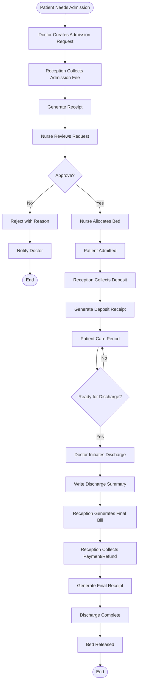

# 🔄 Phase 2: Simplified Workflow for Your Hospital

**Document Version:** 1.0  
**Last Updated:** February 27, 2026  
**Status:** Updated for Simplified Structure

---

## 1. Your Hospital Structure

### 1.1 Roles & Responsibilities

| Role | Primary Responsibilities |
|------|-------------------------|
| **Doctor** | • Create admission requests<br>• Manage admitted patients<br>• Write discharge summaries |
| **Nurse** | • Approve admission requests<br>• Allocate beds<br>• Manage ward patients<br>• Transfer patients between beds |
| **Reception** | • Collect admission fees<br>• Collect deposits<br>• Record all payments<br>• Generate receipts<br>• Handle discharge payments |
| **Admin** | • Configure wards, rooms, beds<br>• Manage system settings<br>• View reports |

---

## 2. Complete Admission Workflow

### 2.1 Step-by-Step Process



---

## 3. Detailed Workflows by Role

### 3.1 Doctor Workflow

#### Create Admission Request
```
1. Complete OPD consultation
2. Decide patient needs admission
3. Open admission request form
4. Fill details:
   - Admission reason
   - Provisional diagnosis
   - Ward type preference (General/Private/ICU)
   - Urgency (Routine/Urgent/Emergency)
   - Admission orders
5. Submit request
6. System notifies Nurse
```

#### Manage Admitted Patients
```
1. View "My Admitted Patients"
2. See all patients under your care
3. Click patient to view details
4. Review vitals, medications, orders
5. Update clinical notes as needed
```

#### Initiate Discharge
```
1. Select patient ready for discharge
2. Click "Initiate Discharge"
3. Fill discharge form:
   - Final diagnosis
   - Hospital course summary
   - Discharge medications
   - Follow-up instructions
4. Submit
5. System notifies Reception for billing
```

---

### 3.2 Nurse Workflow

#### Approve Admission Request
```
1. View admission request queue
2. Requests sorted by urgency:
   🔴 Emergency
   🟡 Urgent
   🟢 Routine
3. Click on request to review
4. Check:
   - Patient details
   - Admission reason
   - Doctor's orders
   - Ward preference
5. Decision:
   - Approve → Move to bed allocation
   - Reject → Provide reason, notify doctor
```

#### Allocate Bed
```
1. View approved admissions
2. Select admission to process
3. Click "Allocate Bed"
4. System shows available beds
5. Filter by:
   - Ward (General/Private/ICU)
   - Room type (Single/Double/Triple)
   - Floor
6. Select appropriate bed
7. Confirm allocation
8. System:
   - Marks bed as occupied
   - Creates admission record
   - Notifies Reception for fee collection
```

#### Manage Ward Patients
```
1. View ward dashboard
2. See all patients in ward
3. Check patient status:
   🔴 Critical
   🟡 Review needed
   🟢 Stable
4. Click patient to view details
5. Actions available:
   - View vitals
   - Check medications
   - Review orders
   - Transfer bed (if needed)
```

#### Transfer Patient Bed
```
1. Select patient
2. Click "Transfer Bed"
3. Select new bed
4. Enter transfer reason
5. Confirm transfer
6. System updates location
```

---

### 3.3 Reception Workflow

#### Collect Admission Fee (At Admission)
```
1. Patient arrives for admission
2. Nurse notifies Reception
3. Reception opens patient billing
4. System shows admission fee (e.g., ₹1,000)
5. Collect payment:
   - Cash
   - Card
   - UPI
   - Cheque
6. Enter payment details
7. Generate receipt
8. Print and give to patient
```

#### Collect Deposit
```
1. After patient admitted
2. Open admission billing
3. Click "Collect Deposit"
4. Enter deposit amount (e.g., ₹10,000)
5. Select payment mode
6. Enter transaction details
7. Generate deposit receipt
8. Print and give to patient/relative
```

#### Daily Charges (Automatic)
```
System automatically adds:
- Room rent (every midnight)
- Nursing charges (if applicable)

Reception can manually add:
- Doctor consultation charges
- Investigation charges
- Procedure charges
- Medication charges
```

#### Discharge Billing
```
1. Doctor initiates discharge
2. Reception receives notification
3. Open patient billing
4. Review all charges:
   - Admission fee (already paid)
   - Room rent (auto-calculated)
   - Consultations
   - Investigations
   - Procedures
   - Medications
5. System calculates:
   - Total charges
   - Total deposits
   - Balance (due or refund)
6. Generate final bill
7. If balance due:
   - Collect payment
   - Generate receipt
8. If refund due:
   - Process refund
   - Generate refund receipt
9. Mark billing cleared
10. System completes discharge
11. Bed is released
```

---

### 3.4 Admin Workflow

#### Configure Wards
```
1. Go to Admin → Wards
2. Click "Add Ward"
3. Enter details:
   - Ward name (e.g., "General Ward A")
   - Ward code (e.g., "GWA")
   - Ward type (General/Private/ICU/Emergency)
   - Floor number
   - Department
   - Total capacity
   - Gender restriction (Male/Female/Mixed)
4. Save
```

#### Configure Rooms
```
1. Go to Admin → Rooms
2. Click "Add Room"
3. Enter details:
   - Room number (e.g., "201")
   - Ward (select from dropdown)
   - Room type (Single/Double/Triple)
   - Bed capacity
   - Room rate per day (e.g., ₹1,500)
   - Amenities (AC, TV, Attached Bath)
4. Save
```

#### Configure Beds
```
1. Go to Admin → Beds
2. Click "Add Bed"
3. Enter details:
   - Bed number (e.g., "201-A")
   - Room (select from dropdown)
   - Bed type (Standard/Electric/ICU)
4. Save
5. Bed status automatically set to "Available"
```

---

## 4. Common Scenarios

### 4.1 Routine Admission

**Timeline:** ~30 minutes

```
09:00 - Doctor creates admission request
09:05 - Nurse reviews and approves
09:10 - Nurse allocates bed (Room 201-A)
09:15 - Reception collects admission fee (₹1,000)
09:20 - Patient moved to ward
09:25 - Reception collects deposit (₹10,000)
09:30 - Patient settled in bed
```

---

### 4.2 Emergency Admission

**Timeline:** ~10 minutes

```
15:00 - Emergency patient arrives
15:02 - Nurse creates emergency admission (skip approval)
15:04 - Nurse allocates emergency bed
15:06 - Patient moved to emergency ward
15:08 - Reception collects fee (after stabilization)
15:10 - Patient receiving care
```

---

### 4.3 Discharge Process

**Timeline:** ~20 minutes

```
10:00 - Doctor initiates discharge
10:05 - Doctor completes discharge summary
10:10 - Reception generates final bill
       Total charges: ₹25,000
       Deposits paid: ₹10,000
       Balance due: ₹15,000
10:15 - Reception collects ₹15,000
10:18 - Reception generates final receipt
10:20 - Patient discharged, bed released
```

---

## 5. Payment Collection Points

### 5.1 When Reception Collects Money

| When | What | Typical Amount |
|------|------|----------------|
| **At Admission** | Admission Fee | ₹1,000 - ₹2,000 |
| **After Admission** | Deposit | ₹5,000 - ₹20,000 |
| **During Stay** | Additional Deposit (if needed) | Variable |
| **At Discharge** | Final Payment (balance) | Variable |
| **At Discharge** | Refund (if excess deposit) | Variable |

### 5.2 Auto-Generated Charges

| Charge | When Added | Who Adds |
|--------|------------|----------|
| Admission Fee | At admission | Reception (manual) |
| Room Rent | Daily at midnight | System (automatic) |
| Nursing Charges | Daily at midnight | System (automatic) |
| Doctor Consultation | After consultation | Reception (manual) |
| Investigations | After lab/imaging | Reception (manual) |
| Procedures | After procedure | Reception (manual) |
| Medications | When dispensed | Reception (manual) |

---

## 6. Key Differences from Original Plan

### 6.1 Simplified Roles

**Original Plan:**
- 5 roles: Doctor, Consultant, Admission Clerk, Ward Nurse, Billing Staff

**Your Hospital:**
- 4 roles: Doctor, Nurse, Reception, Admin

### 6.2 Consolidated Responsibilities

| Function | Original Plan | Your Hospital |
|----------|---------------|---------------|
| Admission Approval | Admission Clerk | **Nurse** |
| Bed Allocation | Admission Clerk | **Nurse** |
| Ward Management | Ward Nurse | **Nurse** |
| Fee Collection | Billing Staff | **Reception** |
| Payment Recording | Billing Staff | **Reception** |
| Deposit Management | Billing Staff | **Reception** |

### 6.3 Benefits of Simplified Structure

✅ **Fewer handoffs** - Nurse handles admission approval + bed allocation  
✅ **Faster process** - Less coordination needed  
✅ **Clear ownership** - Reception owns all money collection  
✅ **Easier training** - Fewer roles to train  
✅ **Better accountability** - Clear responsibility per role  

---

## 7. System Features for Your Structure

### 7.1 For Nurses

**Single Dashboard for:**
- Admission request queue (approve/reject)
- Bed allocation (view availability, allocate)
- Ward patient list (manage patients)
- Bed transfers (move patients)

**Key Feature:** Nurse is the "gatekeeper" - controls admission flow

---

### 7.2 For Reception

**Single Dashboard for:**
- Collect admission fees
- Collect deposits
- Add manual charges
- View patient billing
- Generate final bills
- Collect payments
- Process refunds
- Generate all receipts

**Key Feature:** Reception is the "money handler" - all payments through them

---

### 7.3 For Doctors

**Focus on Clinical:**
- Create admission requests
- View admitted patients
- Write discharge summaries
- No billing/payment involvement

**Key Feature:** Doctor focuses on medical decisions only

---

### 7.4 For Admin

**System Configuration:**
- Setup wards, rooms, beds
- Configure room rates
- Manage users
- View reports

**Key Feature:** Admin sets up infrastructure, doesn't handle daily operations

---

## 8. Quick Reference

### 8.1 Who Does What?

| Task | Who |
|------|-----|
| Create admission request | Doctor |
| Approve admission | Nurse |
| Allocate bed | Nurse |
| Collect admission fee | Reception |
| Collect deposit | Reception |
| Manage ward patients | Nurse |
| Transfer bed | Nurse |
| Add charges | Reception |
| Initiate discharge | Doctor |
| Generate final bill | Reception |
| Collect payment | Reception |
| Complete discharge | System (after payment) |
| Release bed | System (automatic) |
| Configure wards/rooms/beds | Admin |

---

## 9. Training Focus

### 9.1 Nurse Training (Most Critical)

**Why:** Nurses have the most responsibilities
- Admission approval
- Bed allocation  
- Ward management
- Patient transfers

**Duration:** 2-3 hours with extensive hands-on practice

---

### 9.2 Reception Training

**Why:** Handles all money transactions
- Fee collection
- Deposit management
- Payment recording
- Receipt generation

**Duration:** 2 hours with practice on billing scenarios

---

### 9.3 Doctor Training

**Why:** Simple workflow, focused on clinical
- Admission requests
- Discharge summaries

**Duration:** 1 hour, mostly demonstration

---

### 9.4 Admin Training

**Why:** One-time setup
- Ward/room/bed configuration

**Duration:** 1 hour

---

> **Note:** This simplified workflow is designed specifically for your hospital structure where Nurse handles admissions and Reception handles all payments.
