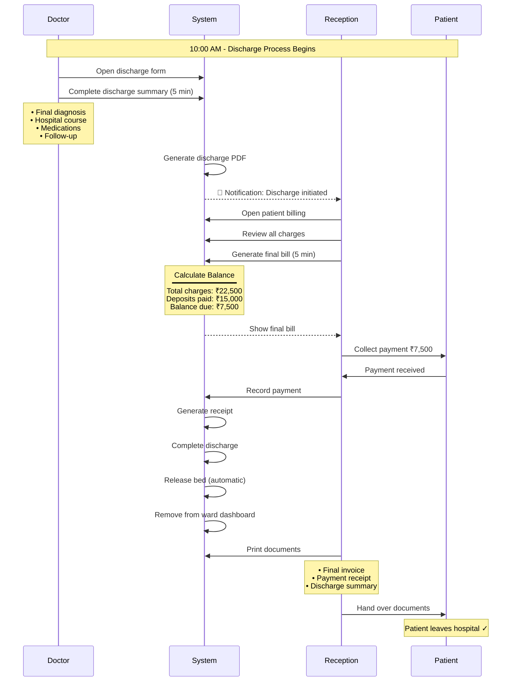
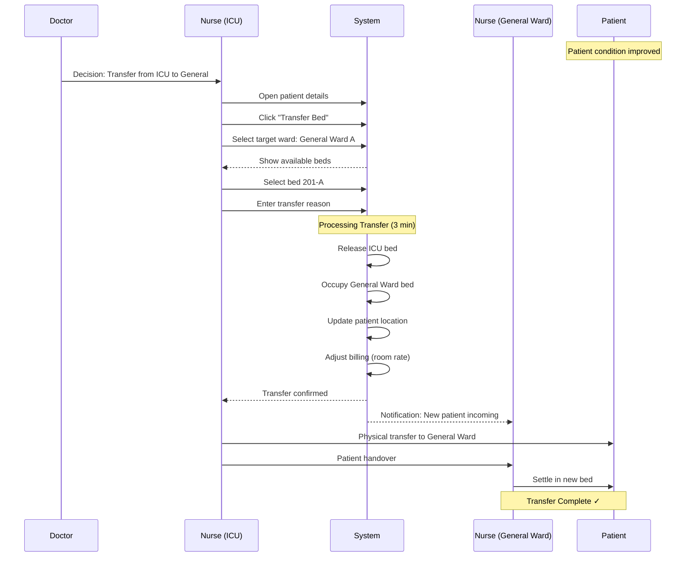

# 🏥 MedFlow Phase 2: IPD Admission Flow

**Complete IPD Workflow Documentation for Medical Staff**

**Document Version:** 1.0  
**Date:** February 27, 2026  
**Status:** Pending Approval

---

## 📋 Table of Contents

1. [Executive Summary](#1-executive-summary)
2. [Hospital Structure & Roles](#2-hospital-structure--roles)
3. [Complete Admission Workflow](#3-complete-admission-workflow)
4. [Doctor Workflows](#4-doctor-workflows)
5. [Nurse Workflows](#5-nurse-workflows)
6. [Reception Workflows](#6-reception-workflows)
7. [Screen Designs](#7-screen-designs)
8. [Common Scenarios](#8-common-scenarios)
9. [Payment Collection Points](#9-payment-collection-points)
10. [System Features](#10-system-features)

---

## 📖 How to Read This Document

**This document is designed for medical staff (doctors, nurses, reception) to understand Phase 2.**

**Quick Navigation:**
- **Busy? Read only:** Section 1 (Executive Summary) + Section 3 (Complete Workflow) + Section 8 (Scenarios)
- **Want details for your role?** Jump to Section 4 (Doctors), Section 5 (Nurses), or Section 6 (Reception)
- **Want to see screens?** Check Section 7 (Screen Designs)
- **Questions about payment?** See Section 9 (Payment Collection Points)

**Visual Elements:**
- 📊 **Mermaid Diagrams** - Visual flowcharts showing processes
- 📦 **ASCII Boxes** - Screen mockups showing what you'll see
- ✅ **Checklists** - Important points to remember
- 🔔 **Icons** - Quick visual indicators

**Document Length:** ~100 pages (but you don't need to read everything!)

---

## 1. Executive Summary

### 1.1 What is Phase 2?

Phase 2 introduces the **IPD (Inpatient Department) Admission Module** - a complete digital system to manage patient admissions from the moment a doctor requests admission until the patient is discharged.

**In Simple Terms:**
- No more paper-based admission requests
- No more manual bed tracking
- No more confusion about which beds are available
- Automatic billing calculations
- All patient information in one place

### 1.2 Key Benefits for Your Hospital

| Benefit | Current Problem | Phase 2 Solution |
|---------|----------------|------------------|
| **Faster Admissions** | Manual process takes 30+ minutes | Digital process takes < 10 minutes |
| **No Bed Conflicts** | Manual tracking causes double-booking | Real-time bed status prevents conflicts |
| **Automatic Billing** | Manual daily rent calculation errors | System auto-calculates room rent daily |
| **Digital Records** | Paper files get lost or damaged | Complete digital history always accessible |
| **Better Coordination** | Phone calls and manual updates | Real-time notifications to all staff |

### 1.3 What Changes for Each Role?

**For Doctors:**
- **Before:** Write admission request on paper, wait for updates, no visibility of patients
- **After:** Create digital request in 2 minutes, view all admitted patients in dashboard, generate PDF discharge summaries

**For Nurses:**
- **Before:** Manual bed tracking, phone calls for coordination, paper registers
- **After:** Real-time bed availability, instant notifications, digital ward dashboard

**For Reception:**
- **Before:** Manual bill calculations, paper receipts, tracking payments manually
- **After:** Auto-calculated bills, digital receipts, complete payment history

---

## 2. Hospital Structure & Roles

### 2.1 Four Main Roles

| Role | Icon | Responsibilities |
|------|------|------------------|
| **DOCTOR** | 👨‍⚕️ | • Create admission requests<br/>• Manage admitted patients<br/>• Write discharge summaries |
| **NURSE** | 👩‍⚕️ | • Approve admission requests<br/>• Allocate beds<br/>• Manage ward patients<br/>• Transfer patients between beds |
| **RECEPTION** | 👤 | • Collect admission fees<br/>• Collect deposits<br/>• Record all payments<br/>• Generate receipts<br/>• Handle discharge billing |
| **ADMIN** | ⚙️ | • Configure wards, rooms, beds<br/>• Manage system settings<br/>• View reports |

### 2.2 Who Does What?

| Task | Responsible |
|------|-------------|
| Create admission request | **Doctor** 👨‍⚕️ |
| Approve admission | **Nurse** 👩‍⚕️ |
| Allocate bed | **Nurse** 👩‍⚕️ |
| Collect admission fee | **Reception** 👤 |
| Collect deposit | **Reception** 👤 |
| Manage ward patients | **Nurse** 👩‍⚕️ |
| Transfer bed | **Nurse** 👩‍⚕️ |
| Add charges | **Reception** 👤 |
| Initiate discharge | **Doctor** 👨‍⚕️ |
| Generate final bill | **Reception** 👤 |
| Collect payment | **Reception** 👤 |
| Complete discharge | **System** ⚙️ (automatic) |
| Release bed | **System** ⚙️ (automatic) |

---

## 3. Complete Admission Workflow

### 3.1 End-to-End Process

**This diagram shows the complete flow from admission request to discharge, including routine admission, emergency admission, patient care, transfers, and discharge.**

```mermaid
flowchart TD

%% =============================
%% COLOR LEGEND
%% =============================

subgraph COLOR_LEGEND [ROLE COLOR LEGEND]
L1[Doctor Action] 
L2[Nurse Action] 
L3[Reception Action] 
L4[System Automatic Process] 
L5[Decision Point] 
L6[Bed Status Change]
end

%% =============================
%% START
%% =============================

A([Patient Needs Admission]) --> B{Admission Type?}

%% =============================
%% ROUTINE FLOW
%% =============================

B -->|"Routine (From OPD)"| C1
B -->|"Emergency"| C2

subgraph ROUTINE_ADMISSION [ROUTINE ADMISSION FLOW]

C1[Doctor completes OPD consultation] --> D1[Click Admission Required]
D1 --> E1[Fill Admission Form]
E1 --> F1[Submit Request]

F1 --> G1[Create Admission Request Record]
G1 --> H1[Notify Nurse]
H1 --> I1[Nurse Reviews Request]
I1 --> J1{Approve?}

J1 -->|Reject| K1[Enter Rejection Reason]
K1 --> L1a[Notify Doctor - Rejected]

J1 -->|Approve| M1[Approve Request]
M1 --> N1[View Available Beds]
N1 --> O1{Bed Available?}

O1 -->|No| P1[Escalate to Admin]

O1 -->|Yes| Q1[Select Bed]
Q1 --> R1[Confirm Admission Details]
R1 --> S1[Create Admission Record]
S1 --> T1[Mark Bed Occupied]
T1 --> U1[Notify Doctor - Bed Allocated]
U1 --> V1[Notify Reception - Collect Fee]

V1 --> W1[Collect Admission Fee]
W1 --> X1[Generate Receipt]
X1 --> Y1[Collect Initial Deposit]
Y1 --> Z1[Generate Deposit Receipt]
Z1 --> AA1[Patient Moves to Ward]
AA1 --> AB1[Settle Patient]
AB1 --> AC1[Patient Status ADMITTED]

end

%% =============================
%% EMERGENCY FLOW
%% =============================

subgraph EMERGENCY_ADMISSION [EMERGENCY ADMISSION FLOW]

C2[Emergency Patient Arrives] --> ED1[Auto Approved]
ED1 --> ED2[Immediate Bed Allocation]
ED2 --> ED3[Mark Emergency Bed Occupied]
ED3 --> ED4[Notify Doctor and Reception]
ED4 --> ED5[Patient Care Starts]
ED5 --> AC1

end

%% =============================
%% CARE PERIOD
%% =============================

AC1 --> CA1[Doctor Ward Rounds]
CA1 --> CA2[Nurse Monitoring]
CA2 --> CA3[Auto Add Room Rent Daily]
CA3 --> CA4[Auto Add Nursing Charges]
CA4 --> CA5[Add Manual Charges]
CA5 --> CA6[Update Billing Balance]
CA6 --> CA7{Balance Negative?}

CA7 -->|Yes| CA8[Notify Reception - Low Balance]
CA8 --> CA9[Collect Additional Deposit]
CA9 --> TR1

CA7 -->|No| TR1

%% =============================
%% TRANSFER
%% =============================

TR1[Continue Patient Care] --> TR2{Transfer Required?}

TR2 -->|Yes| TF1[Click Transfer Bed]
TF1 --> TF2{Same Ward?}

TF2 -->|Yes| TF3[Select New Bed]
TF2 -->|Different Ward| TF4[Enter Transfer Reason]

TF3 --> TF5
TF4 --> TF5[Confirm Transfer]

TF5 --> TF6[Release Old Bed]
TF6 --> TF7[Occupy New Bed]
TF7 --> TF8[Adjust Room Rent Rate]
TF8 --> DC1

TR2 -->|No| DC1

%% =============================
%% DISCHARGE
%% =============================

DC1[Patient Care Continues] --> DC2{Ready for Discharge?}

DC2 -->|No| CA1

DC2 -->|Yes| DD1[Initiate Discharge]
DD1 --> DD2[Fill Discharge Form]
DD2 --> DD3[Generate Discharge PDF]
DD3 --> DD4[Notify Reception]

DD4 --> DB1[Open Final Billing]
DB1 --> DB2[Calculate Total Charges and Deposits]
DB2 --> DB3{Balance Due?}

DB3 -->|Yes - Payment Due| DB4[Collect Final Payment]
DB4 --> DB6

DB3 -->|Refund Excess| DB5[Process Refund]
DB5 --> DB6

DB6[Mark Billing Cleared]
DB6 --> DD5[Complete Discharge]
DD5 --> DD6[Release Bed Automatically]
DD6 --> DD7[Remove From Ward Dashboard]
DD7 --> END([Patient Leaves Hospital])

%% =============================
%% ROLE COLOR DEFINITIONS
%% =============================

classDef doctor fill:#e3f2fd,stroke:#1565c0,stroke-width:2px;
classDef nurse fill:#e8f5e9,stroke:#2e7d32,stroke-width:2px;
classDef reception fill:#fff3e0,stroke:#ef6c00,stroke-width:2px;
classDef system fill:#f3e5f5,stroke:#6a1b9a,stroke-width:2px;
classDef decision fill:#ffebee,stroke:#c62828,stroke-width:2px;
classDef bed fill:#eeeeee,stroke:#424242,stroke-width:2px;

%% Assign legend colors
class L1 doctor;
class L2 nurse;
class L3 reception;
class L4 system;
class L5 decision;
class L6 bed;

%% Assign roles
class C1,D1,E1,F1,CA1,DD1,DD2 doctor;
class I1,M1,N1,Q1,R1,AB1,CA2,TF1,TF3,TF4,TF5 nurse;
class W1,X1,Y1,CA5,CA8,CA9,DB1,DB4,DB5 reception;
class G1,H1,U1,V1,CA3,CA4,CA6,DD3,DD4,DD5 system;
class T1,ED3,TF6,TF7,DD6 bed;
class B,J1,O1,CA7,TR2,TF2,DC2,DB3 decision;
```



**Key Process Flows:**

1. **Routine Admission** - Doctor creates request → Nurse approves & allocates bed → Reception collects fees
2. **Emergency Admission** - Auto-approved → Immediate bed allocation → Care starts immediately
3. **Patient Care Period** - Daily room rent auto-added → Manual charges added → Low balance alerts
4. **Patient Transfer** - Nurse initiates → Select new bed → Automatic billing adjustment
5. **Discharge Process** - Doctor initiates → Reception clears billing → Bed auto-released

---

## 4. Doctor Workflows

### 4.1 Create Admission Request

**When:** After completing OPD consultation, patient needs admission

**Steps:**

```
1. Complete OPD consultation as usual

2. In consultation screen, select "Admission Required"

3. Fill admission request form:
   
   ┌─────────────────────────────────────────────┐
   │ Admission Request Form                      │
   ├─────────────────────────────────────────────┤
   │                                             │
   │ Admission Reason: *                         │
   │ [Severe abdominal pain with fever for 3    │
   │  days, suspected appendicitis]             │
   │                                             │
   │ Provisional Diagnosis: *                    │
   │ [Acute Appendicitis]                       │
   │                                             │
   │ Ward Type Preference: *                     │
   │ ( ) General  ( ) Private  ( ) ICU          │
   │                                             │
   │ Urgency Level: *                            │
   │ ( ) Routine  (•) Urgent  ( ) Emergency     │
   │                                             │
   │ Estimated Stay: [5] days                    │
   │                                             │
   │ Admission Orders: *                         │
   │ [NPO                                       │
   │  IV fluids - NS @ 100ml/hr                 │
   │  IV antibiotics - Ceftriaxone 1g BD        │
   │  Pain management PRN                       │
   │  Vitals q4h                                │
   │  Surgical consult]                         │
   │                                             │
   │ Special Requirements:                       │
   │ [Patient allergic to penicillin]           │
   │                                             │
   │ Diet Instructions:                          │
   │ [NPO until surgery]                        │
   │                                             │
   │        [Cancel]  [Submit Request]           │
   └─────────────────────────────────────────────┘

4. Click "Submit Request"

5. System shows confirmation:
   "Admission request created successfully"
   "Request Number: ADM-REQ-2026-00123"
   "Nurse has been notified"

6. Continue with other patients

7. You will receive notification when bed is allocated
```

**Time Required:** 2-3 minutes

**Important Notes:**
- ✅ Be specific in admission reason (min 20 characters)
- ✅ Write detailed admission orders (min 50 characters)
- ✅ Set appropriate urgency level
- ✅ Mention any allergies or special requirements
- ✅ You'll be notified when bed is allocated

---

### 4.2 View My Admitted Patients

**When:** Anytime you want to check your admitted patients

**Steps:**

```
1. Navigate to "IPD" → "My Admitted Patients"

2. You'll see a dashboard:

   ┌─────────────────────────────────────────────────────┐
   │ My Admitted Patients                        32 Total │
   ├─────────────────────────────────────────────────────┤
   │                                                     │
   │ [Search patients...]                                │
   │                                                     │
   │ ┌─────────────────────────────────────────────────┐ │
   │ │ 🔴 CRITICAL (2)                                  │ │
   │ │                                                  │ │
   │ │ John Doe (MF-2026-00456) • 45M                  │ │
   │ │ Ward: General A • Bed: 201-A • Day 2            │ │
   │ │ Diagnosis: Acute Appendicitis                   │ │
   │ │ [View Details]                                  │ │
   │ └─────────────────────────────────────────────────┘ │
   │                                                     │
   │ ┌─────────────────────────────────────────────────┐ │
   │ │ 🟢 STABLE (28)                                   │ │
   │ │ [Show all...]                                   │ │
   │ └─────────────────────────────────────────────────┘ │
   │                                                     │
   │ ┌─────────────────────────────────────────────────┐ │
   │ │ 🟣 DISCHARGE PENDING (2)                         │ │
   │ │ [Show all...]                                   │ │
   │ └─────────────────────────────────────────────────┘ │
   │                                                     │
   └─────────────────────────────────────────────────────┘

3. Click on any patient to view full details

4. Patient detail page shows:
   • Patient demographics
   • Current location (ward, room, bed)
   • Admission details
   • Current vitals
   • Medications
   • Lab results
   • Admission orders
   • Allergies (highlighted)
```

**Time Required:** Instant access

**Important Notes:**
- ✅ Real-time updates
- ✅ Color-coded by patient status
- ✅ Quick access to all patient information
- ✅ Search by name or UHID

---

### 4.3 Initiate Discharge

**When:** Patient is ready for discharge

**Steps:**

```
1. Select patient from "My Admitted Patients"

2. Click "Initiate Discharge" button

3. Fill discharge form (multiple pages):

   PAGE 1: DISCHARGE DETAILS
   ┌─────────────────────────────────────────────┐
   │ Discharge Date/Time: [2026-03-01] [10:00]  │
   │                                             │
   │ Discharge Type:                             │
   │ (•) Regular                                 │
   │ ( ) LAMA (Leave Against Medical Advice)    │
   │ ( ) Absconded                               │
   │ ( ) Death                                   │
   │ ( ) Transfer to another facility            │
   │                                             │
   │ Final Diagnosis: *                          │
   │ [Post-operative Appendectomy, Recovered]   │
   │                                             │
   │           [Cancel]  [Continue →]            │
   └─────────────────────────────────────────────┘

   PAGE 2: HOSPITAL COURSE
   ┌─────────────────────────────────────────────┐
   │ Hospital Course Summary: * (min 100 chars)  │
   │ ┌─────────────────────────────────────────┐ │
   │ │ Patient admitted with acute appendicitis│ │
   │ │ on 27/02/2026. Underwent laparoscopic   │ │
   │ │ appendectomy on Day 1. Post-operative   │ │
   │ │ recovery uneventful. Wound healing well.│ │
   │ │ Patient ambulating, tolerating diet.    │ │
   │ │ Vitals stable. Ready for discharge.     │ │
   │ └─────────────────────────────────────────┘ │
   │                                             │
   │ Procedures Performed:                       │
   │ • Laparoscopic Appendectomy (27/02/2026)   │
   │   [Add procedure]                           │
   │                                             │
   │ Investigations Summary:                     │
   │ [Pre-op labs: WBC 14,000, CRP elevated.    │
   │  Post-op: WBC normalizing]                 │
   │                                             │
   │           [← Back]  [Continue →]            │
   └─────────────────────────────────────────────┘

   PAGE 3: DISCHARGE MEDICATIONS
   ┌─────────────────────────────────────────────┐
   │ Medications on Discharge:                   │
   │                                             │
   │ 1. Amoxicillin 500mg                       │
   │    Frequency: Three times daily             │
   │    Duration: 7 days                         │
   │    [Remove]                                 │
   │                                             │
   │ 2. Ibuprofen 400mg                         │
   │    Frequency: As needed for pain            │
   │    Duration: 5 days                         │
   │    [Remove]                                 │
   │                                             │
   │ [+ Add Medication]                          │
   │                                             │
   │           [← Back]  [Continue →]            │
   └─────────────────────────────────────────────┘

   PAGE 4: FOLLOW-UP INSTRUCTIONS
   ┌─────────────────────────────────────────────┐
   │ Diet Advice:                                │
   │ [Regular diet, avoid spicy foods for 1     │
   │  week]                                      │
   │                                             │
   │ Activity Restrictions:                      │
   │ [Avoid heavy lifting for 2 weeks, no      │
   │  strenuous exercise for 4 weeks]           │
   │                                             │
   │ Warning Signs:                              │
   │ [Fever > 101°F, increasing abdominal pain, │
   │  wound redness/discharge, persistent       │
   │  vomiting]                                  │
   │                                             │
   │ Follow-up Instructions:                     │
   │ [Follow up in OPD in 1 week for wound     │
   │  check and suture removal]                 │
   │                                             │
   │ Follow-up Date: [2026-03-08]               │
   │                                             │
   │           [← Back]  [Submit Discharge]      │
   └─────────────────────────────────────────────┘

4. Click "Submit Discharge"

5. System generates discharge summary PDF

6. Patient status changes to "Discharge Pending"

7. Reception is notified to process final billing

8. You can print discharge summary anytime
```

**Time Required:** 5-10 minutes

**Important Notes:**
- ✅ Write detailed hospital course (min 100 characters)
- ✅ List all procedures performed during stay
- ✅ Prescribe discharge medications clearly
- ✅ Provide specific follow-up instructions
- ✅ Mention warning signs patient should watch for
- ✅ Discharge summary PDF auto-generated
- ✅ Patient cannot leave until billing cleared by Reception

---

### 4.4 Doctor Dashboard Overview

**What you'll see when you login:**

```
┌─────────────────────────────────────────────────────────┐
│ MedFlow - Doctor Dashboard                    👤 Dr. Smith│
├─────────────────────────────────────────────────────────┤
│                                                         │
│ 📊 Quick Stats                                          │
│ ┌──────────┐ ┌──────────┐ ┌──────────┐ ┌──────────┐   │
│ │ OPD Today│ │ Admitted │ │ Discharge│ │ Pending  │   │
│ │    15    │ │    32    │ │ Pending 2│ │ Requests │   │
│ └──────────┘ └──────────┘ └──────────┘ └──────────┘   │
│                                                         │
│ 🔔 Notifications (3)                                    │
│ • Bed allocated for John Doe - Room 201-A              │
│ • Admission request approved - Jane Smith               │
│ • Lab report ready - Bob Wilson                         │
│                                                         │
│ 🏥 My Admitted Patients                                 │
│ [View All 32 Patients →]                                │
│                                                         │
│ 📋 Pending Admission Requests (1)                       │
│ [View Requests →]                                       │
│                                                         │
│ 📅 Today's Schedule                                     │
│ • 09:00 - OPD Consultation                              │
│ • 14:00 - Ward Round                                    │
│ • 16:00 - Discharge Review                              │
│                                                         │
└─────────────────────────────────────────────────────────┘
```

---

## 5. Nurse Workflows

### 5.1 Approve Admission Request

**When:** New admission request received from doctor

**Steps:**

```
1. Navigate to "IPD" → "Admission Queue"

2. You'll see pending requests sorted by urgency:

   ┌─────────────────────────────────────────────────────┐
   │ Admission Request Queue                      5 Total │
   ├─────────────────────────────────────────────────────┤
   │                                                     │
   │ 🔴 EMERGENCY (1)                                    │
   │ ┌─────────────────────────────────────────────────┐ │
   │ │ ADM-REQ-2026-00123        ⏰ 10 mins ago         │ │
   │ │ John Doe (MF-2026-00456) • 45Y • Male           │ │
   │ │ Diagnosis: Acute Appendicitis                   │ │
   │ │ Ward: General | Urgency: Emergency              │ │
   │ │ Requested by: Dr. Smith                         │ │
   │ │ [View Details] [Approve] [Reject]               │ │
   │ └─────────────────────────────────────────────────┘ │
   │                                                     │
   │ 🟡 URGENT (2)                                       │
   │ [Show all...]                                       │
   │                                                     │
   │ 🟢 ROUTINE (2)                                      │
   │ [Show all...]                                       │
   │                                                     │
   └─────────────────────────────────────────────────────┘

3. Click "View Details" to review full request

4. Review:
   • Patient information
   • Admission reason
   • Provisional diagnosis
   • Ward preference
   • Admission orders
   • Special requirements

5. Decision:
   
   Option A: APPROVE
   ├─ Click "Approve"
   ├─ Add comments (optional)
   ├─ Click "Confirm Approval"
   └─ Request moves to bed allocation queue

   Option B: REJECT
   ├─ Click "Reject"
   ├─ Enter rejection reason (required)
   ├─ Click "Confirm Rejection"
   └─ Doctor is notified with reason

6. Proceed to bed allocation (if approved)
```

**Time Required:** 1-2 minutes per request

---

### 5.2 Allocate Bed

**When:** After approving admission request

**Steps:**

```
1. From admission queue, click "Allocate Bed"
   OR
   Navigate to "IPD" → "Bed Allocation Queue"

2. Select admission to process

3. System shows available beds:

   ┌─────────────────────────────────────────────────────┐
   │ Available Beds                                      │
   ├─────────────────────────────────────────────────────┤
   │                                                     │
   │ Filters: [Ward: General ▼] [Room Type: All ▼]      │
   │                                                     │
   │ General Ward A (8 available)                        │
   │ ┌──────────┐ ┌──────────┐ ┌──────────┐            │
   │ │ 🟢 201-A │ │ 🟢 201-B │ │ 🔴 202-A │            │
   │ │ Double   │ │ Double   │ │ Occupied │            │
   │ │ ₹1500/day│ │ ₹1500/day│ │          │            │
   │ │ AC, TV   │ │ AC, TV   │ │          │            │
   │ │ [Select] │ │ [Select] │ │          │            │
   │ └──────────┘ └──────────┘ └──────────┘            │
   │                                                     │
   │ ┌──────────┐ ┌──────────┐                          │
   │ │ 🟢 203-A │ │ 🟡 204-A │                          │
   │ │ Single   │ │ Reserved │                          │
   │ │ ₹2500/day│ │          │                          │
   │ │ AC, TV,  │ │          │                          │
   │ │ Bath     │ │          │                          │
   │ │ [Select] │ │          │                          │
   │ └──────────┘ └──────────┘                          │
   │                                                     │
   └─────────────────────────────────────────────────────┘

4. Click "Select" on chosen bed

5. Confirm allocation details:

   ┌─────────────────────────────────────────────┐
   │ Confirm Bed Allocation                      │
   ├─────────────────────────────────────────────┤
   │                                             │
   │ Patient: John Doe (MF-2026-00456)          │
   │ Selected Bed: 201-A (General Ward A)       │
   │                                             │
   │ Admission Date/Time:                        │
   │ [2026-02-27] [14:00]                       │
   │                                             │
   │ Attending Doctor:                           │
   │ [Dr. Smith ▼]                              │
   │                                             │
   │ Admission Notes (optional):                 │
   │ [Patient admitted for appendectomy]        │
   │                                             │
   │        [Cancel]  [Confirm Admission]        │
   └─────────────────────────────────────────────┘

6. Click "Confirm Admission"

7. System:
   • Creates admission record
   • Marks bed as occupied
   • Notifies Reception to collect fee
   • Notifies Doctor
   • Patient appears in ward dashboard
```

**Time Required:** 2-3 minutes

**Important Notes:**
- ✅ System prevents double-booking automatically
- ✅ Prefer ward type matching patient preference
- ✅ Consider room rate vs patient affordability
- ✅ Emergency patients get priority

---

### 5.3 Manage Ward Patients

**When:** Daily ward rounds, patient monitoring

**Steps:**

```
1. Navigate to "IPD" → "Ward Dashboard"

2. Select your ward (or see all if assigned to multiple)

3. Ward patient list:

   ┌─────────────────────────────────────────────────────┐
   │ General Ward A                      32/40 Occupied   │
   ├─────────────────────────────────────────────────────┤
   │                                                     │
   │ [Search patients...]  [Room ▼] [Status ▼]          │
   │                                                     │
   │ Bed  │ Patient      │ Age│ Adm Date│ Days│ Status  │
   │──────┼──────────────┼────┼─────────┼─────┼─────────│
   │ 201A │ John Doe     │ 45M│ Feb 27  │  2  │🔴 Crit  │
   │      │ MF-2026-456  │    │ 14:00   │     │Dr.Smith │
   │      │ Appendicitis │    │         │     │ [View]  │
   │──────┼──────────────┼────┼─────────┼─────┼─────────│
   │ 201B │ Jane Smith   │ 32F│ Feb 26  │  3  │🟢 Stable│
   │      │ MF-2026-457  │    │ 10:00   │     │Dr.Lee   │
   │      │ Pneumonia    │    │         │     │ [View]  │
   │──────┼──────────────┼────┼─────────┼─────┼─────────│
   │ 202A │ Bob Wilson   │ 58M│ Feb 25  │  4  │🟡 Review│
   │      │ MF-2026-458  │    │ 09:00   │     │Dr.Khan  │
   │      │ Diabetes     │    │         │     │ [View]  │
   │──────┴──────────────┴────┴─────────┴─────┴─────────│
   │                                                     │
   │ Showing 3 of 32 patients              [Load More]   │
   └─────────────────────────────────────────────────────┘

4. Click "View" on any patient to see full details

5. Patient detail page shows:
   • Demographics & location
   • Current vitals
   • Medications
   • Admission orders
   • Allergies (highlighted in red)
   • Lab results
   • Billing summary

6. Available actions:
   • Transfer bed
   • Update status
   • View history
   • Print summary
```

**Time Required:** Ongoing monitoring

---

### 5.4 Transfer Patient Bed

**When:** Patient needs to move to different bed/ward

**Steps:**

```
1. Open patient details

2. Click "Transfer Bed"

3. Select transfer type:

   ┌─────────────────────────────────────────────┐
   │ Transfer Patient Bed                        │
   ├─────────────────────────────────────────────┤
   │                                             │
   │ Current Location:                           │
   │ General Ward A - Room 201 - Bed 201-A      │
   │                                             │
   │ Transfer Type:                              │
   │ ( ) Same Ward (different bed)               │
   │ (•) Different Ward                          │
   │                                             │
   │ Target Ward: [ICU ▼]                       │
   │                                             │
   │ Available Beds in ICU:                      │
   │ ┌──────────┐ ┌──────────┐                  │
   │ │ 🟢 ICU-1A│ │ 🟢 ICU-1B│                  │
   │ │ ₹5000/day│ │ ₹5000/day│                  │
   │ │ [Select] │ │ [Select] │                  │
   │ └──────────┘ └──────────┘                  │
   │                                             │
   │ Transfer Reason: * (required for inter-ward)│
   │ [Patient condition deteriorated, requires  │
   │  ICU monitoring]                           │
   │                                             │
   │        [Cancel]  [Confirm Transfer]         │
   └─────────────────────────────────────────────┘

4. Click "Confirm Transfer"

5. System:
   • Releases old bed
   • Occupies new bed
   • Updates patient location
   • Logs transfer in history
   • Updates billing (room rate changes)
   • Notifies relevant staff
```

**Time Required:** 2-3 minutes

**Important Notes:**
- ✅ Intra-ward transfer: Simple, no approval needed
- ✅ Inter-ward transfer: Requires detailed reason
- ✅ System updates room rent automatically
- ✅ All transfers logged for audit

---

## 6. Reception Workflows

### 6.1 Collect Admission Fee

**When:** Patient admitted, nurse notifies reception

**Steps:**

```
1. Receive notification: "New admission - John Doe"

2. Navigate to "Billing" → "Collect Fee"

3. Search for patient or select from recent admissions

4. System shows admission fee:

   ┌─────────────────────────────────────────────┐
   │ Collect Admission Fee                       │
   ├─────────────────────────────────────────────┤
   │                                             │
   │ Patient: John Doe (MF-2026-00456)          │
   │ Ward: General Ward A                        │
   │ Bed: 201-A                                  │
   │ Admitted: 27/02/2026 14:00                 │
   │                                             │
   │ Admission Fee: ₹1,000                       │
   │                                             │
   │ Payment Mode: *                             │
   │ (•) Cash  ( ) Card  ( ) UPI  ( ) Cheque    │
   │                                             │
   │ Amount Received: [1000]                     │
   │                                             │
   │ Transaction Reference (if card/UPI):        │
   │ [                    ]                      │
   │                                             │
   │        [Cancel]  [Collect Payment]          │
   └─────────────────────────────────────────────┘

5. Select payment mode

6. Enter amount received

7. Click "Collect Payment"

8. System generates receipt:

   ┌─────────────────────────────────────────────┐
   │         HOSPITAL NAME                        │
   │         Admission Fee Receipt                │
   │                                             │
   │ Receipt No: REC-2026-00123                  │
   │ Date: 27/02/2026 14:15                     │
   │                                             │
   │ Patient: John Doe                           │
   │ UHID: MF-2026-00456                        │
   │ Ward: General Ward A, Bed 201-A            │
   │                                             │
   │ Description          Amount                 │
   │ ─────────────────────────────               │
   │ Admission Fee        ₹1,000                 │
   │                                             │
   │ Total Paid:          ₹1,000                 │
   │ Payment Mode: Cash                          │
   │                                             │
   │ Received by: Reception Staff                │
   │                                             │
   │         [Print]  [Email]  [Close]           │
   └─────────────────────────────────────────────┘

9. Print receipt and give to patient/relative
```

**Time Required:** 2 minutes

---

### 6.2 Collect Deposit

**When:** After patient admitted, as needed during stay

**Steps:**

```
1. Navigate to "Billing" → "Collect Deposit"

2. Search for admitted patient

3. Enter deposit details:

   ┌─────────────────────────────────────────────┐
   │ Collect Deposit                             │
   ├─────────────────────────────────────────────┤
   │                                             │
   │ Patient: John Doe (MF-2026-00456)          │
   │ Current Balance: -₹1,000 (charges exceed)   │
   │                                             │
   │ Deposit Amount: * [10000]                   │
   │                                             │
   │ Payment Mode: *                             │
   │ (•) Cash  ( ) Card  ( ) UPI  ( ) Cheque    │
   │                                             │
   │ For Card/UPI:                               │
   │ Transaction Ref: [TXN123456789]            │
   │                                             │
   │ For Cheque:                                 │
   │ Cheque Number: [          ]                 │
   │ Bank: [          ]                          │
   │ Date: [          ]                          │
   │                                             │
   │ Remarks (optional):                         │
   │ [Initial deposit at admission]             │
   │                                             │
   │        [Cancel]  [Collect Deposit]          │
   └─────────────────────────────────────────────┘

4. Click "Collect Deposit"

5. System generates deposit receipt

6. Print and give to patient/relative

7. Balance updated automatically
```

**Time Required:** 2-3 minutes

**Important Notes:**
- ✅ Can collect multiple deposits during stay
- ✅ System tracks total deposits
- ✅ Balance auto-calculated (deposits - charges)
- ✅ Alert if balance becomes negative

---

### 6.3 Add Service Charges

**When:** Patient receives services (consultations, labs, procedures)

**Steps:**

```
1. Navigate to "Billing" → "Add Charges"

2. Search for patient

3. Add charge:

   ┌─────────────────────────────────────────────┐
   │ Add Service Charge                          │
   ├─────────────────────────────────────────────┤
   │                                             │
   │ Patient: John Doe (MF-2026-00456)          │
   │                                             │
   │ Charge Type: *                              │
   │ [Consultation ▼]                            │
   │ Options: Consultation, Investigation,       │
   │          Procedure, Medication, Other       │
   │                                             │
   │ Service: *                                  │
   │ [Specialist Consultation ▼]                 │
   │                                             │
   │ Description:                                │
   │ [Cardiologist consultation]                │
   │                                             │
   │ Quantity: [1]                               │
   │ Unit Price: ₹500                            │
   │ Total: ₹500                                 │
   │                                             │
   │ Discount (%): [0]                           │
   │ Discount Reason (if applicable):            │
   │ [                    ]                      │
   │                                             │
   │ Net Amount: ₹500                            │
   │                                             │
   │        [Cancel]  [Add Charge]               │
   └─────────────────────────────────────────────┘

4. Click "Add Charge"

5. Charge added to patient bill

6. Balance updated automatically
```

**Time Required:** 1-2 minutes per charge

**Important Notes:**
- ✅ Add charges as services are provided
- ✅ System auto-adds: Admission fee, Room rent (daily)
- ✅ Manually add: Consultations, Labs, Procedures, Meds
- ✅ Discount requires reason and authorization

---

### 6.4 Process Discharge Billing

**When:** Doctor initiates discharge, patient ready to leave

**Steps:**

```
1. Receive notification: "Discharge initiated - John Doe"

2. Navigate to "Billing" → "Discharge Pending"

3. Select patient

4. Review complete bill:

   ┌─────────────────────────────────────────────────────┐
   │ Final Bill - John Doe (MF-2026-00456)              │
   ├─────────────────────────────────────────────────────┤
   │                                                     │
   │ Admission: 27/02/2026  Discharge: 01/03/2026       │
   │ Duration: 3 days                                    │
   │                                                     │
   │ CHARGES                                             │
   │ ─────────────────────────────────────────────────── │
   │ Admission Fee                          ₹1,000       │
   │ Room Rent (3 days @ ₹1,500)           ₹4,500       │
   │ Nursing Charges (3 days @ ₹500)       ₹1,500       │
   │ Doctor Consultation (2 visits)         ₹1,000       │
   │ Specialist Consultation                  ₹500       │
   │ Lab Tests                              ₹3,000       │
   │ Medications                            ₹2,000       │
   │ Procedure - Appendectomy              ₹10,000       │
   │ Other Services                         ₹1,500       │
   │                                                     │
   │ Subtotal:                             ₹25,000       │
   │ Discount (10%):                       -₹2,500       │
   │ ─────────────────────────────────────────────────── │
   │ TOTAL CHARGES:                        ₹22,500       │
   │                                                     │
   │ DEPOSITS                                            │
   │ ─────────────────────────────────────────────────── │
   │ Deposit 1 (27/02/2026):               ₹10,000       │
   │ Deposit 2 (28/02/2026):                ₹5,000       │
   │ ─────────────────────────────────────────────────── │
   │ TOTAL DEPOSITS:                       ₹15,000       │
   │                                                     │
   │ BALANCE DUE:                           ₹7,500       │
   │                                                     │
   │    [Apply Discount]  [Generate Final Bill]          │
   └─────────────────────────────────────────────────────┘

5. Click "Generate Final Bill"

6. Collect payment:

   ┌─────────────────────────────────────────────┐
   │ Collect Final Payment                       │
   ├─────────────────────────────────────────────┤
   │                                             │
   │ Balance Due: ₹7,500                         │
   │                                             │
   │ Payment Mode: *                             │
   │ (•) Cash  ( ) Card  ( ) UPI  ( ) Cheque    │
   │                                             │
   │ Amount Received: [7500]                     │
   │                                             │
   │ Transaction Reference:                      │
   │ [TXN987654321]                             │
   │                                             │
   │        [Cancel]  [Collect Payment]          │
   └─────────────────────────────────────────────┘

7. Click "Collect Payment"

8. System:
   • Marks billing cleared
   • Generates final invoice
   • Generates receipt
   • Completes discharge
   • Releases bed automatically

9. Print documents:
   • Final invoice
   • Payment receipt
   • Discharge summary (already generated by doctor)

10. Handover all documents to patient
```

**Time Required:** 5-10 minutes

**Important Notes:**
- ✅ Review all charges carefully
- ✅ Apply discounts only with authorization
- ✅ If refund due (excess deposit), process refund
- ✅ Cannot complete discharge without payment
- ✅ Print all 3 documents for patient

---

## 7. Screen Designs

### 7.1 Doctor - Create Admission Request

```
┌─────────────────────────────────────────────────────────┐
│ MedFlow                Create Admission Request  👤 Dr.  │
├─────────────────────────────────────────────────────────┤
│                                                         │
│  ← Back to Consultation                                 │
│                                                         │
│  ┌─────────────────────────────────────────────────────┐│
│  │ 👤 Patient: John Doe (MF-2026-00456) • 45Y • Male  ││
│  │ Current Visit: OPD-2026-00789                       ││
│  └─────────────────────────────────────────────────────┘│
│                                                         │
│  ┌─────────────────────────────────────────────────────┐│
│  │ 📋 Admission Details                                ││
│  │ ─────────────────────────────────────────────────── ││
│  │                                                     ││
│  │ Admission Reason: * (min 20 characters)             ││
│  │ ┌─────────────────────────────────────────────────┐││
│  │ │ Severe abdominal pain with fever for 3 days,   │││
│  │ │ suspected appendicitis. Patient needs surgical │││
│  │ │ intervention.                                   │││
│  │ └─────────────────────────────────────────────────┘││
│  │                                                     ││
│  │ Provisional Diagnosis: *                            ││
│  │ [Acute Appendicitis]                               ││
│  │                                                     ││
│  │ Ward Type Preference: *                             ││
│  │ ○ General  ○ Private  ○ ICU  ○ Emergency           ││
│  │                                                     ││
│  │ Urgency Level: *                                    ││
│  │ ○ Routine  ● Urgent  ○ Emergency                   ││
│  │                                                     ││
│  │ Estimated Stay: [5] days                            ││
│  │                                                     ││
│  │ Admission Orders: * (min 50 characters)             ││
│  │ ┌─────────────────────────────────────────────────┐││
│  │ │ 1. NPO                                          │││
│  │ │ 2. IV fluids - NS @ 100ml/hr                   │││
│  │ │ 3. IV antibiotics - Ceftriaxone 1g BD          │││
│  │ │ 4. Pain management PRN                         │││
│  │ │ 5. Vitals q4h                                  │││
│  │ │ 6. Surgical consult                            │││
│  │ └─────────────────────────────────────────────────┘││
│  │                                                     ││
│  │ Special Requirements:                               ││
│  │ [Patient allergic to penicillin]                   ││
│  │                                                     ││
│  │ Diet Instructions:                                  ││
│  │ [NPO until surgery]                                ││
│  │                                                     ││
│  │                    [Cancel]  [Submit Request]       ││
│  └─────────────────────────────────────────────────────┘│
│                                                         │
└─────────────────────────────────────────────────────────┘
```

### 7.2 Nurse - Bed Allocation

```
┌─────────────────────────────────────────────────────────┐
│ MedFlow                  Bed Allocation          👤 Nurse│
├─────────────────────────────────────────────────────────┤
│                                                         │
│  ← Back to Queue                                        │
│                                                         │
│  ┌─────────────────────────────────────────────────────┐│
│  │ 👤 Patient: John Doe (MF-2026-00456) • 45Y • Male  ││
│  │ Diagnosis: Acute Appendicitis                       ││
│  │ Ward Preference: General | Urgency: Urgent          ││
│  │ Requested by: Dr. Smith                             ││
│  └─────────────────────────────────────────────────────┘│
│                                                         │
│  ┌─────────────────────────────────────────────────────┐│
│  │ 🛏️ Available Beds                                    ││
│  │ ─────────────────────────────────────────────────── ││
│  │ [Ward: General ▼]  [Room Type: All ▼]  [Floor: 2▼] ││
│  │                                                     ││
│  │ General Ward A (8 available)                        ││
│  │ ┌──────────┐ ┌──────────┐ ┌──────────┐ ┌──────────┐││
│  │ │ 🟢 201-A │ │ 🟢 201-B │ │ 🔴 202-A │ │ 🟢 203-A │││
│  │ │ Double   │ │ Double   │ │ Occupied │ │ Single   │││
│  │ │ ₹1500/day│ │ ₹1500/day│ │          │ │ ₹2500/day│││
│  │ │ AC, TV   │ │ AC, TV   │ │          │ │ AC, TV,  │││
│  │ │          │ │          │ │          │ │ Bath     │││
│  │ │ [Select] │ │ [Select] │ │          │ │ [Select] │││
│  │ └──────────┘ └──────────┘ └──────────┘ └──────────┘││
│  │                                                     ││
│  │ [Show more beds...]                                 ││
│  └─────────────────────────────────────────────────────┘│
│                                                         │
│  ┌─────────────────────────────────────────────────────┐│
│  │ 📝 Allocation Details                               ││
│  │ ─────────────────────────────────────────────────── ││
│  │ Selected Bed: 201-A (General Ward A, Room 201)      ││
│  │                                                     ││
│  │ Admission Date/Time: [2026-02-27] [14:00]          ││
│  │ Attending Doctor: [Dr. Smith ▼]                     ││
│  │ Admission Notes: [Patient admitted for appendectomy]││
│  │                                                     ││
│  │                    [Cancel]  [Confirm Admission]    ││
│  └─────────────────────────────────────────────────────┘│
│                                                         │
└─────────────────────────────────────────────────────────┘
```

### 7.3 Reception - Discharge Billing

```
┌─────────────────────────────────────────────────────────┐
│ MedFlow              Discharge Billing        👤 Reception│
├─────────────────────────────────────────────────────────┤
│                                                         │
│  ← Back to Discharge Queue                              │
│                                                         │
│  ┌─────────────────────────────────────────────────────┐│
│  │ 👤 Patient: John Doe (MF-2026-00456)                ││
│  │ Admitted: 27/02/2026 | Discharge: 01/03/2026 (3d)  ││
│  │ Ward: General Ward A, Bed 201-A                     ││
│  └─────────────────────────────────────────────────────┘│
│                                                         │
│  ┌─────────────────────────────────────────────────────┐│
│  │ 💰 Final Bill Summary                               ││
│  │ ─────────────────────────────────────────────────── ││
│  │                                                     ││
│  │ CHARGES                                             ││
│  │ Admission Fee                          ₹1,000       ││
│  │ Room Rent (3 days)                     ₹4,500       ││
│  │ Nursing Charges                        ₹1,500       ││
│  │ Consultations                          ₹1,500       ││
│  │ Investigations                         ₹3,000       ││
│  │ Procedures                            ₹10,000       ││
│  │ Medications                            ₹2,000       ││
│  │ Other Services                         ₹1,500       ││
│  │                                                     ││
│  │ Subtotal:                             ₹25,000       ││
│  │ Discount (10%):                       -₹2,500       ││
│  │ ───────────────────────────────────────────────     ││
│  │ TOTAL CHARGES:                        ₹22,500       ││
│  │                                                     ││
│  │ DEPOSITS PAID:                        ₹15,000       ││
│  │ ───────────────────────────────────────────────     ││
│  │ BALANCE DUE:                           ₹7,500       ││
│  │                                                     ││
│  │ [View Detailed Bill]  [Apply Discount]              ││
│  └─────────────────────────────────────────────────────┘│
│                                                         │
│  ┌─────────────────────────────────────────────────────┐│
│  │ 💳 Collect Payment                                  ││
│  │ ─────────────────────────────────────────────────── ││
│  │                                                     ││
│  │ Amount to Collect: ₹7,500                           ││
│  │                                                     ││
│  │ Payment Mode:                                       ││
│  │ ● Cash  ○ Card  ○ UPI  ○ Cheque                    ││
│  │                                                     ││
│  │ Amount Received: [7500]                             ││
│  │ Transaction Ref: [                    ]             ││
│  │                                                     ││
│  │              [Cancel]  [Collect & Complete Discharge]││
│  └─────────────────────────────────────────────────────┘│
│                                                         │
└─────────────────────────────────────────────────────────┘
```

---

## 8. Common Scenarios

### 8.1 Routine Admission (Normal Flow)

**Timeline:** ~30 minutes total

**Step-by-Step:**
- **09:00 AM** - Doctor completes OPD consultation, creates admission request (2 min)
- **09:05 AM** - Nurse receives notification, reviews and approves request (1 min)
- **09:10 AM** - Nurse views available beds, selects appropriate bed, confirms allocation (2 min)
- **09:15 AM** - Reception receives notification, collects admission fee ₹1,000 (2 min)
- **09:20 AM** - Patient moved to ward, nurse settles patient
- **09:25 AM** - Reception collects deposit ₹10,000 (2 min)
- **09:30 AM** - Patient fully admitted, bed marked occupied

---

### 8.2 Emergency Admission (Fast Track)

**Timeline:** ~10 minutes total

**Step-by-Step:**
- **15:00 PM** - Emergency patient arrives in critical condition
- **15:02 PM** - Nurse creates emergency admission (auto-approved, skips approval step)
- **15:03 PM** - Nurse immediately allocates emergency bed (1 min)
- **15:04 PM** - Patient moved to emergency ward, immediate medical care begins
- **15:06 PM** - Reception collects fee after stabilization (may defer if critical)
- **15:08 PM** - Reception collects deposit (or deferred to later)
- **15:10 PM** - Patient receiving care, all documentation completed

---

### 8.3 Discharge Process (Complete)

**Timeline:** ~30 minutes total



**Step-by-Step:**
- **10:00 AM** - Doctor decides patient ready for discharge, opens discharge form
- **10:05 AM** - Doctor completes discharge summary (final diagnosis, hospital course, medications, follow-up)
- **10:10 AM** - Reception receives notification, opens patient billing, reviews all charges
- **10:15 AM** - Reception generates final bill (Total: ₹22,500, Deposits: ₹15,000, Balance due: ₹7,500)
- **10:20 AM** - Reception collects payment ₹7,500, generates receipt
- **10:23 AM** - System completes discharge, bed automatically released, patient removed from ward dashboard
- **10:25 AM** - Reception prints documents (final invoice, payment receipt, discharge summary)
- **10:30 AM** - Patient leaves hospital with all documents

---

### 8.4 Patient Transfer (ICU to General Ward)

**Timeline:** ~15 minutes



**Step-by-Step:**
- **14:00 PM** - Patient condition improved, doctor decides to transfer from ICU to General
- **14:02 PM** - Nurse opens patient details, clicks "Transfer Bed", selects target ward
- **14:05 PM** - Nurse views available beds in General Ward, selects bed 201-A, enters transfer reason
- **14:08 PM** - System processes transfer (releases ICU bed, occupies General Ward bed, updates location, adjusts billing)
- **14:10 PM** - Patient physically moved, ICU nurse hands over to General Ward nurse
- **14:15 PM** - Transfer complete, patient settled in new bed, all systems updated

---

## 9. Payment Collection Points

### 9.1 When Reception Collects Money

| When | What | Typical Amount | Payment Mode |
|------|------|----------------|--------------|
| **At Admission** | Admission Fee | ₹1,000 - ₹2,000 | Cash/Card/UPI |
| **After Admission** | Initial Deposit | ₹5,000 - ₹20,000 | Cash/Card/UPI |
| **During Stay** | Additional Deposit (if low balance) | Variable | Cash/Card/UPI |
| **At Discharge** | Final Payment (balance due) | Variable | Cash/Card/UPI |
| **At Discharge** | Refund (if excess deposit) | Variable | Cash/Cheque |

### 9.2 Auto-Generated Charges

| Charge | When Added | Amount | Added By |
|--------|------------|--------|----------|
| Admission Fee | At admission | ₹1,000 | Reception (manual) |
| Room Rent | Daily at midnight | ₹1,500/day | System (automatic) |
| Nursing Charges | Daily at midnight | ₹500/day | System (automatic) |

### 9.3 Manual Charges

**Manual Charges (Added by Reception):**

| Charge | When Added | Added By |
|--------|------------|----------|
| Doctor Consultation | After doctor visit | Reception |
| Specialist Consultation | After specialist visit | Reception |
| Lab Tests | After lab work | Reception |
| Imaging (X-ray, CT, MRI) | After imaging | Reception |
| Procedures | After procedure | Reception |
| Medications | When dispensed | Reception |
| Other Services | As provided | Reception |

---

## 10. System Features

### 10.1 Real-Time Updates

**What Updates in Real-Time:**
- ✅ Bed availability (when allocated/released)
- ✅ Ward patient list (when admitted/discharged/transferred)
- ✅ Admission request queue (when new request created)
- ✅ Billing balance (when charges added or deposits collected)
- ✅ Notifications (all role-specific notifications)

**Technology:** WebSocket connections for instant updates

---

### 10.2 Notifications

**Doctors Receive:**
- 🔔 Bed allocated for your admission request
- 🔔 Admission request approved/rejected
- 🔔 Lab report ready for your patient
- 🔔 Patient condition alert (critical status)

**Nurses Receive:**
- 🔔 New admission request created
- 🔔 Emergency admission needed
- 🔔 New patient admitted to your ward
- 🔔 Patient transferred to your ward

**Reception Receives:**
- 🔔 New admission - collect fee
- 🔔 Discharge initiated - process billing
- 🔔 Low balance alert - collect deposit
- 🔔 Payment due reminder

---

### 10.3 Reports & Analytics

**Available Reports:**
- 📊 Daily admission summary
- 📊 Ward occupancy rates
- 📊 Average length of stay
- 📊 Discharge summary
- 📊 Revenue report
- 📊 Doctor-wise admissions
- 📊 Ward-wise statistics

**Access:** Admin and authorized users only

---

### 10.4 Data Security

**Security Features:**
- 🔒 Role-based access control (RBAC)
- 🔒 Audit trail (all actions logged)
- 🔒 Data encryption
- 🔒 Secure login (JWT authentication)
- 🔒 Session timeout (30 minutes)
- 🔒 Password policy enforcement

**Compliance:** HIPAA-ready, patient data protected

---

**END OF IPD FLOW DOCUMENTATION**

---

> **Status:** ✅ Ready for Review by Medical Staff  
> **Version:** 1.0 | **Date:** February 27, 2026